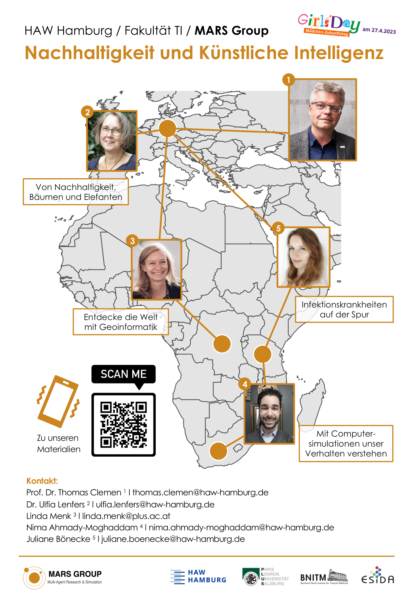

Girls' Day is an annual event during which school-aged girls can attend various activities focused on introducing them to different professions and fields in academia and industry. A special emphasis is placed on historically male-dominated domains such as computer science, engineering, and craft professions. For more information (in German), please see the [Girls' Day 2023 website](https://www.girls-day.de/).

In 2023, Girls' Day takes place on April 25th, and the MARS Group is excited to contribute by offering an interactive workshop to eight girls between the ages 12&mdash;14. The workshop will cover topics such as:

- Discussing artificial intelligence (AI) in **sustainability**
- Discovering the world with **geoinformatics**
- Capturing human behavior in **agent-based models**
- Understanding infection outbreaks with **epidemiology**

We look forward to welcoming "our" girls and hope for interesting discussions and learnings!

