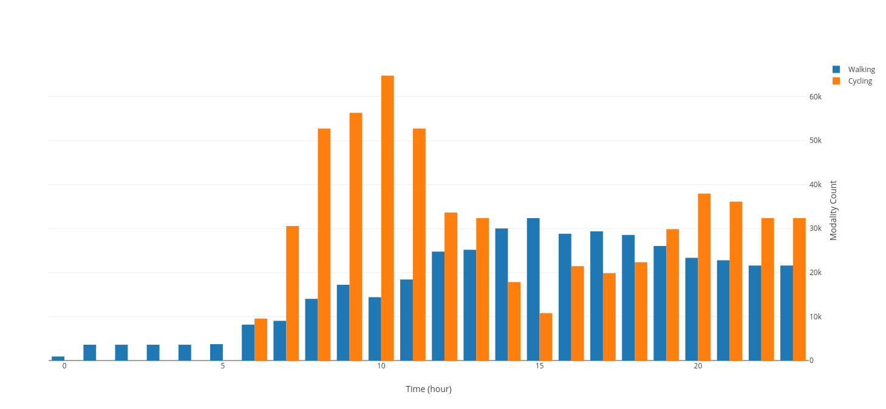
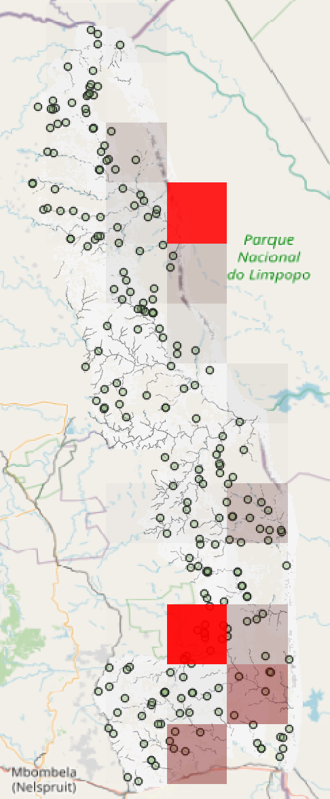
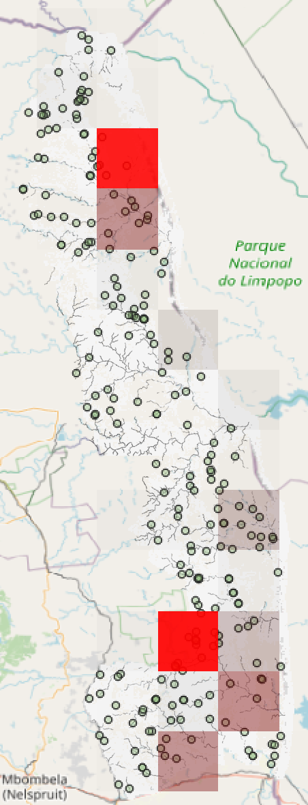
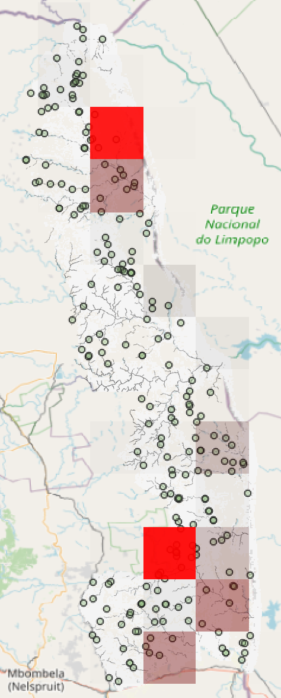

# Analyzing Simulation Output

Simulation outputs can be analyzed and plotted with various tools. In this article, the analysis with [FalconSQL](https://plotly.com/chart-studio-help/database-connectors/personal-login/) is used as an example.

___

## How to plot simulation output data with FalconSQL

**FalconSQL** requires data stored in a database. Set the output to use one of the supported relational output kinds, described [here](../model-configuration/sim_output_formats.md).

1. Go to [Plotly](https://plotly.com/chart-studio-help/database-connectors/personal-login/) and download and install FalconSQL for your desired operating system.

2. Create a connection to your running database or database file (e.g., when using SQLite more about the output formats [here](../model-configuration/sim_output_formats.md)). If FalconSQL is connected (in the Connection tab), you can submit SQL queries (in the query tab) to extract and visualize the desired data.

3. After the query ran successfully, the extracted attributes are available in the Chart tab. Click `Trace` to generate a new plot. You can generate multiple traces to visualize and compare different data.

4. In the Export tab, click `Upload chart`. You will be directed a Chart Studio Plotly site in your web browser, where you can create, edit, and share a dashboard that contains your diagrams.

5. Below is an example of visualization using simulation data that was stored in a PostgreSQL database. The simulation time was 24 hours and agents were able to travel on foot and by bike. The query submitted to FalconSQL was:

   ```sql
   SELECT CAST(TRUNC(EXTRACT(HOUR FROM "Citizen"."DateTime")) AS INTEGER) AS "hr:DateTime",
   SUM((CASE WHEN ("Citizen"."ModalityCount" = 1) THEN "Citizen"."ModalityCount" ELSE NULL END)) AS "sum:Calc_walk",
   SUM((CASE WHEN ("Citizen"."ModalityCount" = 3) THEN "Citizen"."ModalityCount" ELSE NULL END)) AS "sum:Calc_cycle"
   FROM "mars"."Citizen" "Citizen"
   GROUP BY 1
   ```

   Using the data that was returned from the database, the following diagram was generated:
   
   The chart shows the number of walking and cycling agents per hours for the duration of the 24-hour simulation time.

___

## How to plot simulation output data with Tableau

Tableau can take your simulation's output data via a csv file or a database connection. Tableau is a useful tool for analyzing and aggregating data as well as creating custom functions to process data as needed.

1. Download and install Tableau from [here](https://www.tableau.com/de-de/products/desktop/download) 

   ​	**Note:** Students can use this link to obtain the free education version from [here](https://www.tableau.com/academic/students).

2. Open Tableau and select your data source (csv or database connection).

3. _Tableau_ offers online [Tutorials and Documentation](https://help.tableau.com/current/pro/desktop/en-us/gettingstarted_overview.htm).

___

## How to create a heat map of agents density per tick

The system offers a Python-based script used to create _heat maps_ of objects per simulation tick. Simulation output data needs to be available in a csv file. Per default, the script is in the directory `Analysis`.

1. In a terminal, navigate to the folder where the script is located. **Note:** Python needs to be installed on your system and added to your system's path variable to be able to run the script from the terminal. Execute the script by entering the parameters:

      ```bash
      csvtoasc.py <path_to_file_without_file_extension> <grid_cell_size> <column_name_of_longitude> <column_name_of_latitude> 
      ```
      | Parameter | Description | Example |
      | :----------------------------------------------------------: | :----------------------------------------------------------: | :----------------------------------------------------------: |
      |  <path_to_file_without_file_extension>  |          Absolute or relative path to the file `CSV`. **Please do not include the file extension.** file |  Citizen (_not Citizen.csv_)|
      |  <grid_cell_size>  |          Number that specifies the size of a single grid cell (in degrees) of the heat map you wish to generate |  **0.25**|
      |  <column_name_of_longitude>  |          Name of the column in the output csv file from which longitude data should be retrieved. **This value depends on your csv file** |  **Lon** |
      |  <column_name_of_latitude>  |          the name of the column in the output csv file from which latitude data should be retrieved. **This value depends on your csv file** |  **Lat**|

2. The script generates a folder in the working directory and stores an asc file per tick inside the folder.

3. You can load the asc files into QGIS (e.g., via drag-and-drop) to visualize them.

4. OpenStreetMap data (or the layer data from your model) can be layered below the heat maps to show where on the map (and at what time of the simulation) agents were positioned. Below is an example of three heatmaps showing the difference in agent density during three different simulation ticks:

   |  |  |  |
   | :----------------------------------------------------------: | :----------------------------------------------------------: | :----------------------------------------------------------: |
   |                           morning                            |                             noon                             |                           evening                            |

   

   