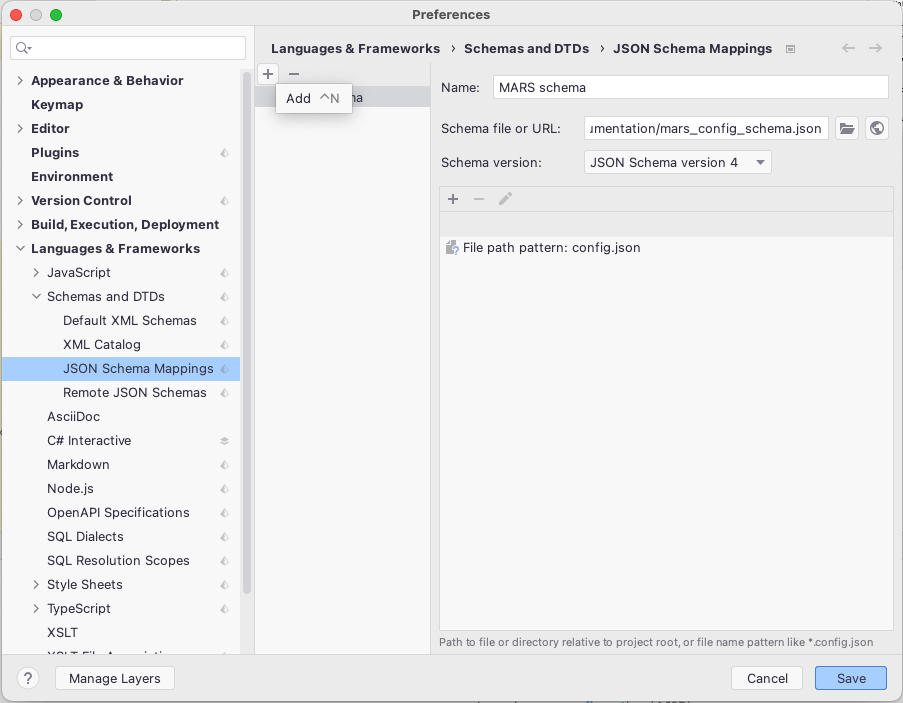

### Model Configuration

- [Agent Configuration](agent_config.md): Explains how to configure agent types.

  

- [Layer Configuration](layer_config.md): Explains how to configure layers.

  

- [Output Filter](output_filter.md): Explains how to configure output filters.

  

- [Simulation Configuration Options](sim_config_options.md): Lists the simulation configuration options available for the config.

- [Simulation Output Formats](sim_output_formats.md): Describes the different formats in which simulation output data can be stored 

---
#### Schema support

The simulation configuration is generally stored in a ``config.json`` file. Because json is a pure data format and not a schema-based format, it has no native support for schema definitions. But it would be nice to have a guidline how to fill the config.json, knowing which options are available and which parts of configuration are mandatory.

For this purpose, we use _json schema_. It is supported by multiple IDEs; the following describes a short introduction how to use it in Rider.
Open the `JetBrainsRider`->`preferences` menu. Go to `Languages & Framework` -> `Schemas and DTDs` -> `JSON Schema Mappings`. Paste the [URL of the MARS schema](https://git.haw-hamburg.de/mars/model-deployments/-/raw/master/Documentation/mars_config_schema.json) to `Schema file or URL`:
>[https://git.haw-hamburg.de/mars/model-deployments/-/raw/master/Documentation/mars_config_schema.json](https://git.haw-hamburg.de/mars/model-deployments/-/raw/master/Documentation/mars_config_schema.json)
> 
Use the preselected `Schema version:` `JSON Schema version 4`. 

Add a `File path pattern` for files that are named `config.json`. `Save`.

That's it. Know you have full schema support for manipulation on your simulation configuration json-file.

