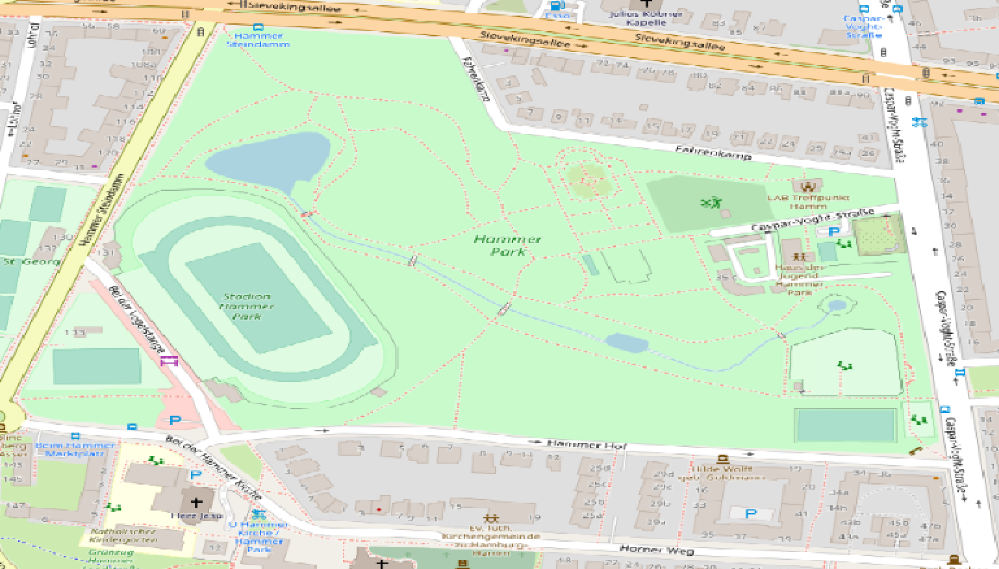
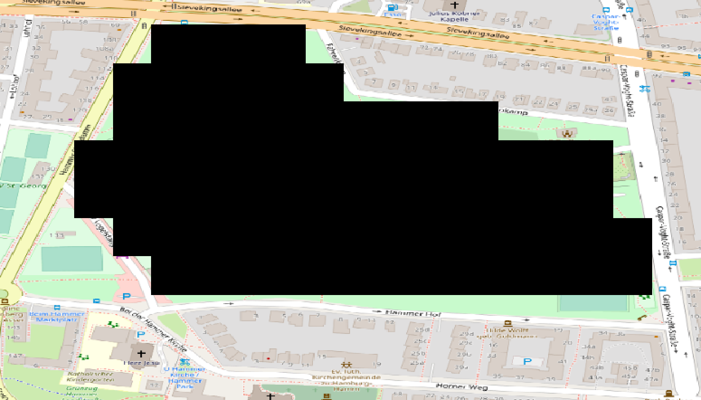

# How to prepare a vector/raster layer file

This tutorial offers a step-by-step guide on how to create a raster layer that can be used to populate a raster layer in a MARS model.

For more information on layers, please check out this [article](../development/layers.md).

## Finding the geographic area

1. Open QGIS
2. In the Browser window (center left), open the "XYZ Tiles" drop-down menu.
3. From there, drag-and-drop OpenStreetMap into the Layer window (bottom left). This should open a world map in the main window of QGIS.
4. On the map, navigate to where you want to obtain geodata from.

___

## Creating a blank layer in QGIS

<ol>
    <li>In the tool bar above the map, click on "Create new temporary layer" (German: "Neuen Temporärlayer anlegen").</li>
    <li>In the pop-up menu:<ol>
        <li>Specify the new layer's name</li>
        <li>Select "Polygon / CurvePolygon" from the geometry type drop-down menu.</li>
        <li>Select EPSG:4326 - WGS 84</li>
        <li>Click OK</li>
        </ol></li>
    <li>Your new layer should now be visible in the Layer window</li>
</ol>

___

## Marking the required area on the map

- Click the pencil icon in the tool bar (if it is not already selected) to enter edit mode.
- Click the icon "Add a polygon".

        
- On the map, draw the desired shape of your raster layer. When you are finished, right-click anywhere on the map.
- Click the pencil icon in the tool bar and select Save in the pop-up menu.
- You now have your desired shape as a vector layer. If this is the desired format:
    - Right-click the layer in the Layer window.
    - Select "Export" and "Save object as...".
    - Specify the file name and format. (For more information, please check out this <A HREF = "../data-sources/geospatial_data_types.md">article</A>)
    - Click OK
- You now have a vector layer file ready for use in your MARS model. For more information on how to configure layers, please check out this <A HREF = "../model-configuration/layer_config.md">article</A>.

___

## How to convert a vector layer to a raster layer in QGIS

Follow these steps to convert a vector layer to a raster layer in QGIS:	

<ol>
    <li>Load your vector layer into QGIS (e.g., by dropping the layer file into the main editing window).</li>
    <li>Select the vector layer in the Layer window.</li>
    <li>Click "Raster" in the top menu bar and navigate to "Convert" and "Rasterize".</li>
    <li>Specify the vector layer as "input layer".</li>
    <li>Select "Georeferenced unit" as output (under "output raster size units").</li>
    <li>Specify Width and Height.<ol>
        <li><b>Note:</b> these numbers refer to longitude and latitude and are measured in degrees (°). They determine how many cells your raster layer will be divided into horizontally and vertically. Depending on the geographic dimensions (size) of your layer, you might need to select small numbers to be able to place enough cells in the layer.</li>
        </ol></li>
    <li>Under "output size", select the three dots and click "use layer dimensions".<ol>
        <li>In the pop-up menu, select the vector layer you want to convert to a raster layer and click OK.</li>
        </ol>
    </li>
</ol>

<ol>
    <li>Set the "Blank Value" to 1.</li>
    <li>Click "Start". Once the algorithm has finished, click "Close".</li>
    <li>Your raster layer should now be available in the Layer window (bottom left). Select the layer, then click on "Raster" in the top menu bar and select "Convert" and "Convert format".</li>
    <li>Specify the raster layer as "input layer".</li>
    <li>Under "convert", select the three dots and "Save in file...".</li>
    <li>Specify the path of your file and .asc as the file format.</li>
    <li>Click OK. You now have a raster layer file ready for use in your MARS model.</li>
</ol>
