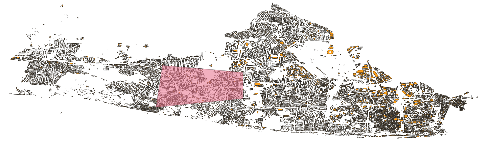
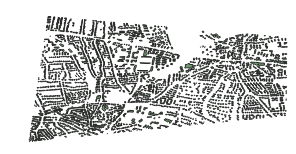
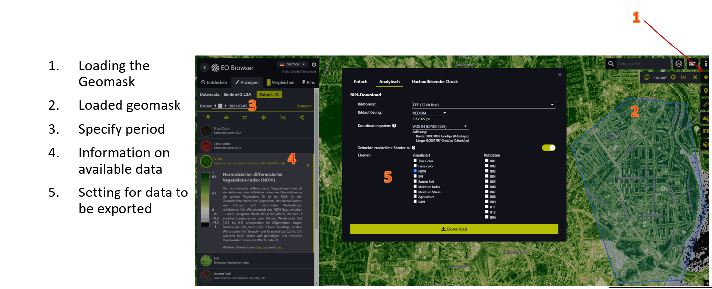
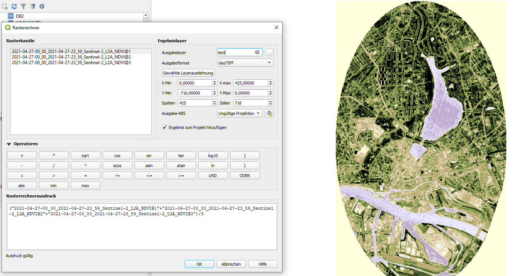
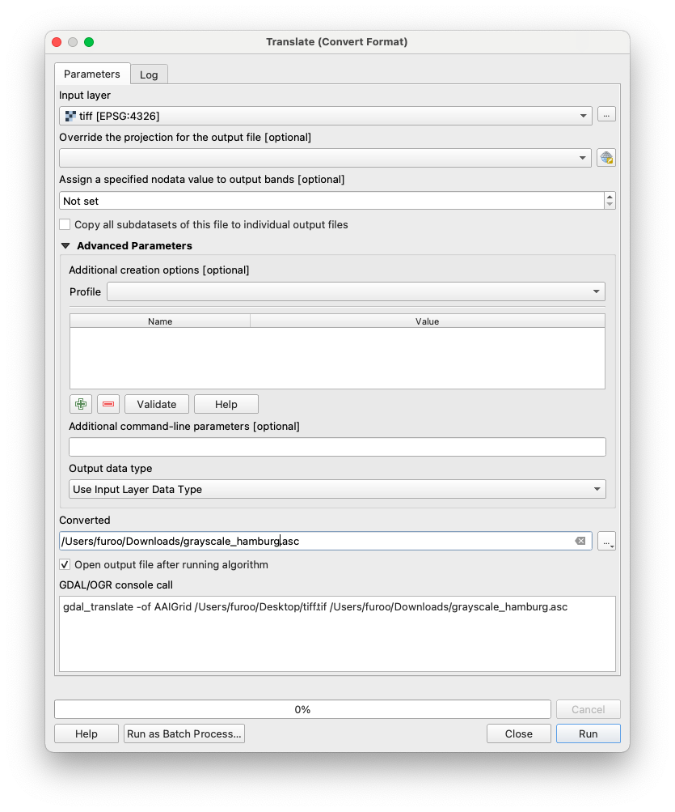
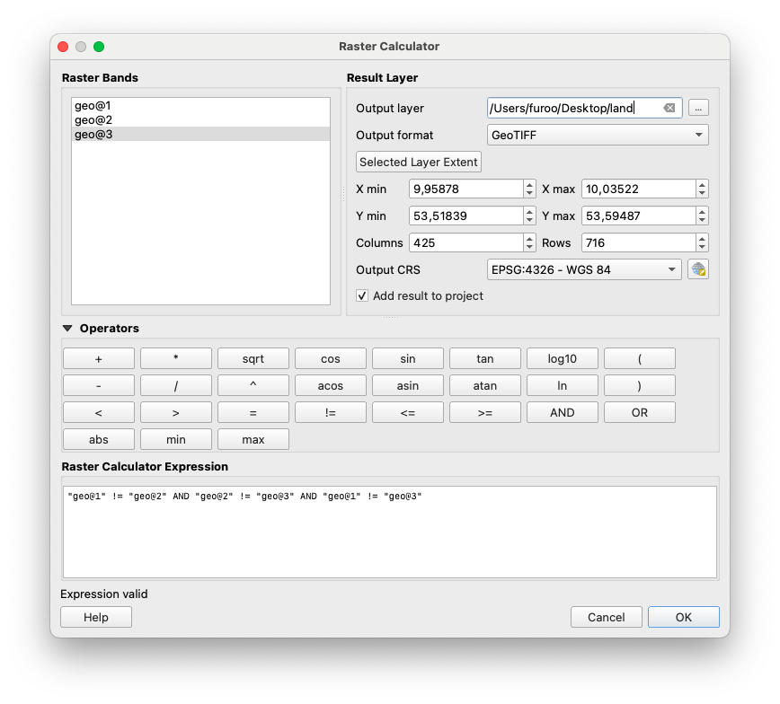
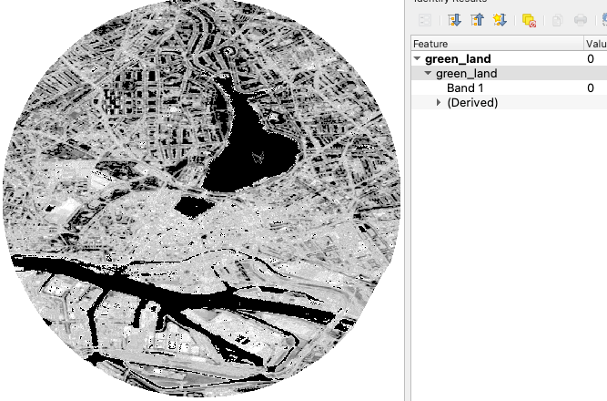
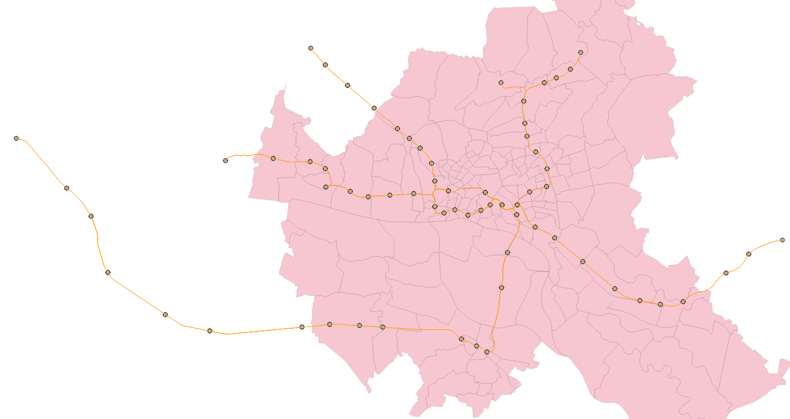
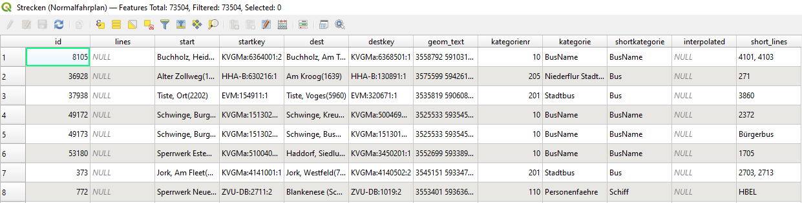
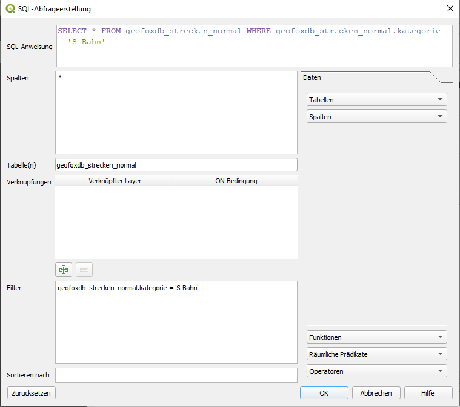

# Generation and use of geo-information data

## 1. Find geographic data in a reasonable dimension

For a simulation it is necessary to decide on a geographic space. This should not be too large and not too small. Therefore define a bounding box that limits the expansion. 

For the usage with the tool QGIS see [How to prepare a vector/raster layer file](create_vector_layer_raster_layer.md)

## 2. Using OSMnx to generate layer data

[OpenStreetMap (OSM)](https://www.openstreetmap.org/) provides a [Python](https://www.python.org/) library and associated API to store specific geographic areas in a suitable format. This library is called OSMnx. Generally it provides various geographic data, in fact it is mostly used for graph data. 

1. Installing the [OSMnx package](https://osmnx.readthedocs.io/en/stable)
2. [Examples of usage](https://github.com/gboeing/osmnx-examples)


:::note
On Windows additional packages are required for proper working: the GDAL package for your respective python version. Using an example with the Galapagos Island and the use of OSMnx.
:::

```python
import osmnx as ox

def save_place(place_name):
    # Retrieve the vector boundary of the area we need
    place = ox.geocode_to_gdf(place_name)
    place.to_file("galapagos.geojson", driver='GeoJSON')

if __name__ == '__main__':
    place_name = 'Galapagos Islands'
    # Its also possible to become more than one boundary in the same vectorfile
    	# place_name = ['Isla Isabela, Ecuador', 'Isla Santiago, Ecuador']
    save_place(place_name)
```


## 3. Using a bounding box to reduce dimension of given data from a base model

If data is available in a suitable format, it is possible to crop it using [QGIS](https://qgis.org/de/site/). This way it is easy to save the desired area with a few provided tools.

The model environment is already available (e.g., in the form of a base model) and a subsection (corresponding to the bounding box) is to be extracted
   1. Import a given layer file (*base layer*) in QGIS (drag-and-drop). This is our *Input layer*.
   2. [Create a mask (bounding box) in a temporal layer](create_vector_layer_raster_layer.md)  that limits the geographic extent. This is our *Overlay layer*.
      1. Layer &#8594; Create Layer &#8594; New Temporary Scratch Layer 
      2. Drop-down menu "Geometry type": MultiPolygon (most often sufficient)
      3. Ok
      4. Edit &#8594; Add "any polygon form that fits your requirements"
      5. Layer &#8594; Toggle Editing &#8594; Save
   3. Vector (possibily Vektor) &#8594;  geo processing tools &#8594; Intersection...
   4. Drop-down menu "Input layer": base layer
   5. Drop-down menu "Overlay layer": bounding box (or the other way around)
   6. Click "Start"
   7. A new layer (*intersect layer*) containing the intersected geodata appears in the Layer window (bottom left)
   8. Export the intersect layer:
      1. Right-click the intersect layer
      2. Select "Export" and "Save as"
      3. Specify the file name and file format
      4. Click "OK"
    
Base data with red bounding box (above) and the new data in dimension of mask as result (below).




## 4. Using the bounding box with data from the EO Browser (ESA)

If the necessary data are not available, it is possible to obtain them via a browser (satellite data freely available from ESA). How to crop the data is explained in this section.

:::note 
To download the files in a geo format, an account is required. Accounts are for free.
:::

1. Model environment is **not** available; data acquisition via external data sources
2. **EO Browser:** freely available satellite images (globally) from the ESA (European Space Agency)
3. Visit [https://apps.sentinel-hub.com/eo-browser](https://apps.sentinel-hub.com/eo-browser/) (a tutorial with first steps is available, if needed)
4. Upload your bounding box:
   1. Click the pentagon icon (top right) and drag-and-drop the file containing the bounding box into the EO Browser
5. Specify the time range for the desired data and click "Search"
6. Select one of the available data set (The down-arrows provide additional information)
7. Select the desired geodata from within the data set
8. Select "Download image" (right)
9. Switch to the tab "Analytical"
10. Select the file format TIFF
11. Activate "Clip extra bands" (if not already activated)
12. Select "Download" 



## 5. Generating a raster layer from a GeoTIFF file

The Mars Runtime System uses vector and raster layers. In order to make raster layers usable, it is necessary to bring them into a suitable format. GeoTiff files cannot be used directly. This section explains how to transform to ASC files that are readable for the runtime system.

### 1. Transform the GeoTiff file to an ASC file

1. Import the desired `tiff` file into QGIS (drag-and-drop)
2. We require the layer in greyscale.
    1.Raster &#8594; Raster Calculator
    2. Enter the formula (R + G + B) / 3 into the raster calculator expression (R = chanel 1, G = chanel 2, B = chanel 3)
    3. From "raster chanels", select the three chanels R, G, and B. These appear in the raster calculator expression. Enclose them with round parentheses and divide the expression by 3.
      
    4. In "Result layer" &#8594; "Output layer" specify the file name and file format (GeoTIFF)
    5. Select OK
3. Save the newly generated layer (let's call it *GrayscaleGEOTIFF*) as an asc file
   1. Raster &#8594; Conversion &#8594; Translate (Convert Format)/ Convert (format conversion)...
   2. Input layer: GrayscaleGEOTIFF
   3. In the field "Converted", click "…" and "Save to File…"
   4. Specify the file name and file format (ASC)
      
   5. Click "Save"
   6. Click "Run"
7. The geodata are exported from QGIS and saved as an asc file

:::note 
An `asc` file contains only one band. This example assumes a `tiff` file with three bands (red, green, and blue). Generally, it is important to specify which band should be exported. For a `geotiff` file with only one band, no additional steps are necessary.
:::

### 2. Manipulation of GeoTIFF file 

GeoTiff are widespread. The bands may represent different data. Sometimes it is useful to mark specific areas as invalid. In the upcoming example, we want to remove values for water.

1. Recognize that water has the same value in all 3 different bands.
   
2. Open Raster &#8594; Raster Calculator...
3. Insert an expression that specifies only valid band data. In our case, we only want to have data, where all bands have different data (water has here the same data in all three bands / compare screenshot).
   For example: ```"geo@1" != "geo@2" AND "geo@1" != "geo@3" AND "geo@2" != "geo@3"```
4. Set Output layer path for layer creation. Ok.
   
5. Open Raster &#8594; Raster Calculator...
6. Make a new expression that combines your data with the created mask (in our example, the land geo tiff that is multiplied with the green band/geo@“). 
   ```"geo@2" * "land@1"```
   Set the Output layer. Ok.
   

Now the water areas all have the Band value `0`. If you even need it to be invalid, another transformation is necessary.
1. Open Raster &#8594; Raster Calculator...
2. Make a new expression that devides the value and multiplies it afterwards. All values that are `0` are now transformed to `no data`.
   ```"green_land@1"/"green_land@1" *"green_land@1"```
   Set the Output layer. Ok.
   


## 6. Public data sources

There are many freely available data sources.  When researching on the internet, one comes across many portals and sites that offer geoinformation data, some of them are listed in the following.

Geographically limited
- [Geoportal](https://geoportal.de) geodata provided by federal, state and local authorities.
- [Geoportal Hamburg](https://geoportal-hamburg.de) geodata provided by federal, state and local authorities. Limited to Hamburg.
- [The Afica GeoPortal](https://www.africageoportal.com/) provides a variety of data from covid to desert locust.

Global
- [OpenSteetMap](https://openstreetmap.org) holds a map of the world with street networks and additional data.
- [ESA Copernicus Open Access Hub](https://scihub.copernicus.eu/dhus/#/home) the Open Access Hub provides complete, free and open access to Sentinel-1, Sentinel-2, Sentinel-3 and Sentinel-5P user products.
- [EO Browser](https://apps.sentinel-hub.com/eo-browser/) provides satellite data.
- [Natural Earth](http://www.naturalearthdata.com/downloads/) provides cultural, physical and raster categories.
- [IPUMS TERRA](https://terra.ipums.org/) integrates population and environmental data across disciplinary scientific domains.
- [NASA Earth Observation](https://neo.sci.gsfc.nasa.gov/) provides satellite data (ocean, atmosphere, and land surfaces).
- [Socioeconomic data and applications center SEDAC](https://sedac.ciesin.columbia.edu/) provides socioeconomic data sets.
- [Open Topography](https://opentopography.org/) provides high-resolution topography data and tools.
- [FAO GeoNetwork](http://www.fao.org/geonetwork/srv/en/main.home) provides interactive maps, satellite imagery and related spatial databases.
- [meteostat](https://meteostat.net/de) offers world wide weather and climate data.
- [WorldClim](https://www.worldclim.org/) offers maps, graphs, tables, and data of the global climate.
- [United Nations Environmental Data Explorer](http://geodata.grid.unep.ch/) covers themes like Freshwater, Population, Forests, Emissions, Climate, Disasters, Health and GDP.
- [ArcGIS Hub](https://hub.arcgis.com/search) provides a broad collection of diverse data.
- [ESRI](https://www.esri.de/de-de/home) provides a broad collection of diverse data.


However, the data offered is available in very similar formats. The format `geotiff`, `geojson`, or `shapefile` can be interpreted by QGIS and must potentially be edited.


## 7. OpenStreetMap as data source

[OpenStreetMap (OSM)](https://www.openstreetmap.org/) is a free and rich data source for a wide variety of data. There are road networks, buildings, rivers and much more. Much of this data can be accessed via the website. It may be worthwhile to have a look here to see if there is something suitable (for your own question).

1. Download a desired area via a QGIS plugin:
   1. Follow these steps for installation and usage: http://www.qgistutorials.com/de/docs/downloading_osm_data.html
2. Download the desired area via an internet browser:
   1. Visit [OpenStreetMap](https://www.openstreetmap.org/)
   2. Click "Export" (located in the top bar)
   3. Specify the desired area (this can also be done by selecting "Select another area manually")
   4. Click "Export"
   5. An `osm` file is downloaded which can be imported into and visualized in QGIS (drag-and-drop)

:::note
If the area is too large, the import into QGIS might fail.
:::

## 8. Time series layer

Time series layers are used to represent data that should change during the course of a simulation. In order to realise this, the desired data are provided with a time stamp to tell the system at which point in time which file has to be taken.

Time series layers are used by the MARS Runtime System to include time-dependent data in simulation runs. These data must be in the form of a raster layer (`asc` file). Additionally, a metadata.csv file must be present. This `csv` file specifies the point in time at which a particular file should be used as a layer in the simulation. The `csv` file is structured as follows:

| Date                | File                        |
| ------------------- | --------------------------- |
| 2010-01-01T00:00:00 | wc2.1_2.5m_tmin_2010-01.asc |
| 2010-02-01T00:00:00 | wc2.1_2.5m_tmin_2010-02.asc |
| 2010-03-01T00:00:00 | wc2.1_2.5m_tmin_2010-03.asc |

The ASC file may look like the example below.
- ``ncols`` describes the number of columns for that data is stored
- ``nrows`` describes the amount of rows respectively
- ``xllcorner`` is the left lower longitudinal corner of the whole raster
- ``yllcorner`` is the left lower latitudinal corner of the whole raster
- ``cellsize`` defines dimension of a grid cell in minutes
- ``nodata_value`` is the default value that symbolizes that for that cell no data is available

```asc
ncols 4  
nrows 8  
xllcorner 30.5  
yllcorner -26  
cellsize 0.5  
nodata_value -9999  
17.807290649414 20.5651184082032 24.8631225585938 26.8945098876953
18.5511718750001 23.3313079833985 26.29580078125 27.8574005126953
20.4051147460938 25.4935241699219 27.5471893310547 28.5036560058594
27.4903656005859 28.1041198730469 28.9388061523438 29.2906738281251
28.8996826171876 29.4988952636719 30.3407836914063 31.0566650390625
30.1418853759766 30.5633178710938 31.2210021972657 31.8191162109376
30.4041229248047 31.273828125 31.6893402099609 31.8025604248047
31.709634399414 31.8638244628907 31.8258911132813 32.0521179199219
```


The `asc` files and the metadata.csv must be stored in the same directory (may also be zipped).

## 9. Data usage in MARS

Data is made usable in the MARS system via layers. These layers contain a wide variety of data with which an agent can interact.

How to use a layer file during a MARS model simulation can be found [here](../configuration/layer_config.md).

:::note
Data from external sources should always be validated regarding completeness, integrity, and plausibility.
:::

# 10 Data acquisition using the example of HVV

The utilisation of data obtained from external sources is an important step in the use of geoinformation data. This article uses the example of the HVV to show how to make S-Bahn lines available for a specific area of Hamburg.

1. Find the source
    1. Open the side: https://geoportal-hamburg.de/geo-online/
    2. Click on "Themen" in the upper left-hand corner
    3. Click on "Fachdaten" in the dropdown-menue
    4. Click on "Transport und Verkehr"
    5. Click on "HVV Streckennetz für Bahn-, Bus- und Fährlinien Hamburg"
    6. Click on the icon "i"
    7. A window opens. Click on the "WMS-Adresse" tab
    8. Save the link to the clipboard
2. Integrate source in QGIS
   1. Launch QGIS
   2. On the left in the browser window. Left click on "WFS / OGC API - Feature"
   3. select "new connection..."
   4. In the new dialogue window, give the connection a name (we use "HVV") and copy the link into the column for the URL
   5. Click "Ok"
   6. Now open the new "HVV" tab and drag "Strecken (Normalfahrplan)" into the Layer window
       1. Check that the coordinate system at the bottom right is set to WGS84 EPGS:4326
3. Now load your mask as an additional layer
4. Intersect the layer as in the article "Using a bounding box given data from a base model"
    1. Drop-down menu "Input layer": Strecken (Normalfahrplan)
    2. Drop-down menu "Overlay layer": The Mask
    3. Click "Start"
5. To add the stations repeat the same steps as with "Strecken (Normalfahrplan)" only this time with "Haltestellen"
6. Now intersect the stops with the output layer from the last intersection
7. To save the data in **one** geojson, right-click on the first intersection (routes) and export it as a geojson
8. Now do the same with the second intersection (stations) and save it in the same file
    1. A dialogue opens. Click on "Attach to Layer" and "Ok"



# 11 View attributes of the data

When using free data, the included attributes of data are very different. It is possible to check with QGIS after loading the data what information is in the data. We will take an example from Hamburg [here](https://opendata-esri-de.opendata.arcgis.com/datasets/esri-de-content::ortsteile-hamburg/geoservice?geometry=7.279%2C53.395%2C11.459%2C53.965). The data we use is a Hamburg vector layer. It contains all districts and boroughs of the city.

1. Load the file into QGIS
2. Right click on the layer. In the menu click on "Open attribute table"
   1. All the information contained in the layer is displayed here



It is possible to apply certain operations to the attributes. In this way it is also possible to use only certain parts of a layer. In the following example we will cut out the district of Altona.

1. Double click on the layer
2. in the "Source" window there is a tab "Object filter on data provider". At the bottom right click on the button "Query creation"
3. In the dialogue under "Fields" we double-click on "Bezirk_Nam"
   1. You can also view the information contained in a field in the values window
   2. This name is now displayed in the Provider Specific Filter Expression field
4. The Provider Specific Filter Expression window must contain this expression: "Bezirk_Nam" = 'Altona'
   1. It is possible to create a more complex query with logical operators
5. Click on "Ok"
6. Now we have chosen the district of Altona


**Hint:** Depending on the version of QGIS, the query may also look different. Here is an example as an SQL query with the HVV and the S-Bahn routes.




# 11 View attributes of the data / filter by data

When using free data, the included attributes of data are very different. It is possible to check with QGIS after loading the data what information is in the data. We will take an example from Hamburg [here](https://opendata-esri-de.opendata.arcgis.com/datasets/esri-de-content::ortsteile-hamburg/geoservice?geometry=7.279%2C53.395%2C11.459%2C53.965). The data we use is a Hamburg vector layer. It contains all districts and boroughs of the city.

1. Load the file into QGIS
2. Right click on the layer. In the menu click on "Open attribute table"
   1. All the information contained in the layer is displayed here


It is possible to apply certain operations to the attributes. In this way it is also possible to use only certain parts of a layer. In the following example we will cut out the district of Altona.

1. Double click on the layer
2. in the "Source" window there is a tab "Object filter on data provider". At the bottom right click on the button "Query creation"
3. In the dialogue under "Fields" we double-click on "Bezirk_Nam"
   1. You can also view the information contained in a field in the values window
   2. This name is now displayed in the Provider Specific Filter Expression field
4. The Provider Specific Filter Expression window must contain this expression: "Bezirk_Nam" = 'Altona'
   1. It is possible to create a more complex query with logical operators
5. Click on "Ok"
6. Now we have chosen the district of Altona


:::note
Depending on the version of QGIS, the query may also look different. 
:::

Here is an example as an SQL query with the HVV and the S-Bahn routes:


