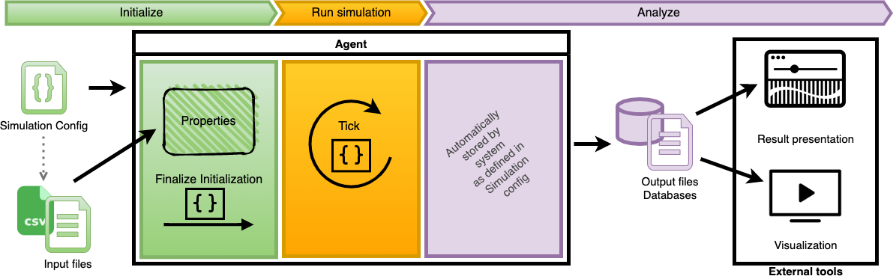
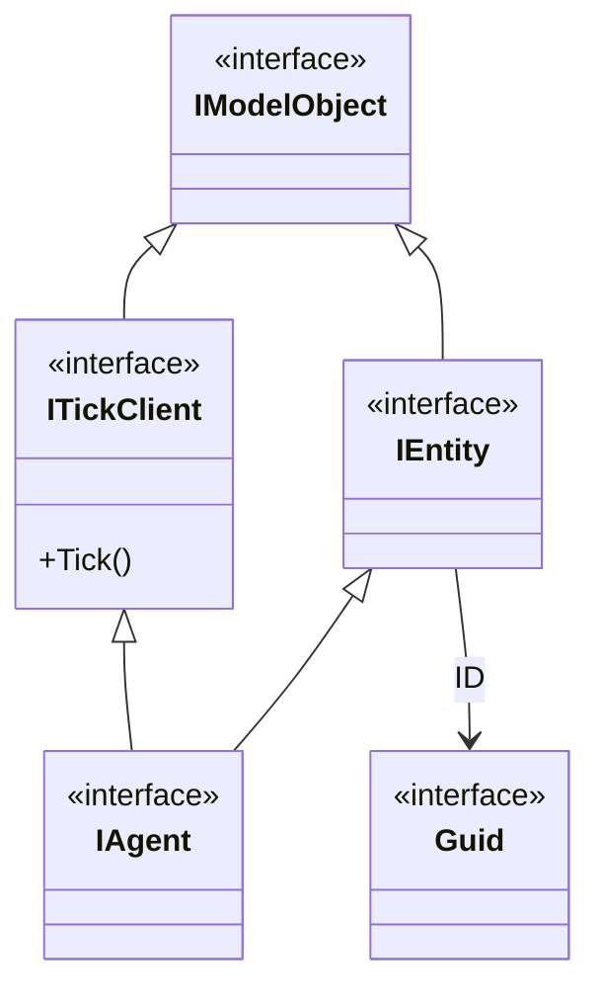

# Agent

## Definition of Agents

Along with [layers](layers.md), agents are the main part of every model. Once the layers have been created, agent types can be specified. For this step, the modeler needs to know what each agent type is going to be, what attributes define it, and what its actions will look like. Once this has been established, the agent type creation can be started.

Agents are the central part of the MARS simulation, which can be viewed as an information system with three phases. First, there is some kind of input data that is integrated in the model, either in layer or agent. The model execution is then performed and generates output data in different formats for analyzation.


A more detailed view on the system emphasises that the input files are described in the [simulation config](../configuration/sim_config_options.md). The input data is used to initialize certain properties of the agent, which may afterwards finalize the initialization process with model code. The model execution ticks the agent in every time step. The output is created automatically by the system. Output formats as well as filter criteria need to be defined in the simulation config. To analyze the results, as for now, external tools are required. 




## Implementation of Agents

Agent types are defined by implementing the `IAgent<TLayer>` interface. The `IAgent<TLayer>` interface expects the implementation of the `Init(TLayer)` and the `Tick()` method as well as a unique identifier in form of a [UUID](https://en.wikipedia.org/wiki/Universally_unique_identifier) ([Guid](https://learn.microsoft.com/en-us/dotnet/api/System.Guid?view=netstandard-2.0)) which has to be assigned by the `ID` property.

The agent and entity contract is structured as follows:



In the model code a `using` import for the namespace `Mars.Interfaces.Agents` must be added:

```csharp
using Mars.Interfaces.Agents;
```

An agent definition may look like this. 

```csharp
using Mars.Interfaces.Agents;

public class MyAgentType : IAgent<MyLayer> 
{
    public void Init(MyLayer layer) 
    {
	    // finalize the init process
    }
    
    public void Tick() 
    {
	    // define your logic here
    }
    
    public Guid ID { get; set; }
}
```

Each agent type, which shall be available for the scenario configuration have to be registered within the `ModelDescription`. 

Use method ``AddAgent<TAgentType, TLayerType>()`` expects therefore the connection of the agents to its responsible layer:


```csharp
// Define the description when not already happened
// var description = new ModelDescription();

// Register the agent type before adding the agent type.
description.AddLayer<MyLayerType>();

description.AddAgent<MyAgentType, MyLayerType>();
```

When each agent type is registered, the type and their parameter can be used within the [scenario configuration](../configuration/agent_config.md). 


:::note

Note that the respective layer type must be registered to the `ModelDescription` beforehand.

:::


## Passing input to the Agent

To initialize agents or entities with given inputs the `IAgentManager` or the `IEntityManager` is used. Both components read the scenario configuration and use the mapping to create objects from it.

For example, to use the `IAgentManager`, a layer (more on defining layers [here](layers.md)) can be used to load the component that provides the `IAgentManager` interface, for example inside the `InitLayer()` method:

```csharp
public class MyAgentLayer : AbstractLayer 
{
    public override bool InitLayer(TInitData layerInitData, RegisterAgent registerAgentHandle, UnregisterAgent unregisterAgentHandle)
    {
        base.InitLayer(layerInitData, registerAgentHandle, unregisterAgentHandle);
        // Resolve the required model component.
        var agentManager = layerInitData.Container.Resolve<IAgentManager>();
        
        // Create and register objects of type MyAgentType.
        var agents = agentManager.Spawn<MyAgentType>();
        
        // Otherwise only create them but do not registering 
        // to trigger their Tick() method. 
        var nonRegisteredAgents = agentManager.Create<MyAgentType>().ToList();
        
        return true;
    }
}
```

The `Spawn<MyAgentType>()` call creates and registers a set of agents from the configuration, unless otherwise specified in the call, and uses the mapping to assign properties of each `MyAgentType` object with the desired value.

> The number of agents is defined in the configuration via the `count` switch.


:::danger

The `Spawn<MyAgentType>()` call returns an **iterator for creating and registering** objects. The [.NET Language Integrated Query (LINQ)](https://docs.microsoft.com/de-de/dotnet/csharp/programming-guide/concepts/linq/) technology allows subsequent queries on the set of objects before they are actually created. Only when `ToList()` is iterated or called do the statements actually pass through. 

:::

Using `PropertyDescription` annotation for those parameters of an agent or entity which shall be assigned with input data from outside. Properties must be publicly visible and have both a `get` (getter) and `set` (setter) to allow values to be written.


````csharp
public class MyAgentType : IAgent<MyLayer> 
{
    [PropertyDescription]
    public double InputProperty { get; set; }


    public void Init(MyLayer layer) { }
    
    public void Tick() 
    {
        // do something with the input
	    Console.WriteLine(InputProperty);
    }
    
    public Guid ID { get; set; }
} 

````

The `PropertyDescription` is used to mark properties of a type to make this a scenario configuration (described [here](../configuration/agent_config.md)) externally visible.

Inside the `mappings` a value or indirection mapping can be done via the name of the model element (here `InputProperty`).

### Direct value assignment

Values for properties can be assigned to instances of a type directly in the configuration. A direct assignment assigns the property via a name (here `InputProperty`) with a desired value that conforms to the typing of the property (`double`-precision value of `InputProperty`).

```json
{
  "name": "MyAgentType",
  "mappings":[
    {"name": "InputProperty", "value": 3.141 } 
  ]
}
```

The system tries to convert the input to the type automatically, so other input such as value written as `"3.14"` are also possible. However, if the input does not conform to the given type, an exception is raised. For example, the `InputProperty` which is typed as `double` is assigned the value `true`:

```json
{
  "name": "MyAgentType",
  "mappings":[
    {"name": "InputProperty", "value": true } 
  ]
}
```

Then the system throws the following exception:

:::danger

The type `Double` for property `InputProperty` is not compatible with input `True`.

:::


### Indirect value assignment

An *indirect value assignment* allows to initialize each instance of an agent with its individual data objects. These data objects are stored in a file (for instance a csv-file), which is assigned to the agent type in the simulation config.
A given source (here `myAgentType.csv`) contains _x_ data objects (rows, without header row). Each data row represents one agent instance:

| fieldNameInCsv | anotherField |
|----------------|--------------|
| 0.481          | gold         |
| 1.482          | silver       |
| 79.13          | copper       |
| 100.48         | platinum     |

The attribute `fieldNameInCsv` of the input `myAgentType.csv` **does not** correspond to the name `InputProperty` of the model object. To access the values of the field, the field name must be specified to _redirect_ the access reading the source:

```json
{
  "name": "MyAgentType",
  "file": "myAgentType.csv",
  "mappings":[
    {"name": "InputProperty", "field": "fieldNameInCsv" }
  ]
}
```

### Alternative names

Instead of the property name from the model (here `InputProperty`) a field `Name` with an alternative attribute name can be specified at the `PropertyDescription`.

````csharp
public class MyAgentType : IAgent<MyLayer> 
{
    [PropertyDescription(Name = "myOtherName"]
    public double InputProperty { get; set; }
} 
````

Mapping of values can now be specified via `MyInputProperty` and `myOtherName`:

```json
{
  "name": "MyAgentType",
  "mappings":[
    {"name": "myOtherName", "value": 3.141 }
  ]
}
```

### Required properties

Models that define parameters that **must be externally mapped** can specify this requirement as `Required` in `PropertyDescription`. To initialize an object, there must then be a mapping for the respective annotated properties, otherwise the system throws an exception.

```csharp
public class MyAgentType : IAgent<MyLayer> 
{
    [PropertyDescription(Required = true)]
    public double InputProperty { get; set; }
} 
```