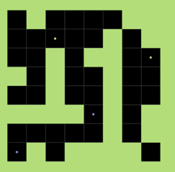
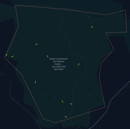
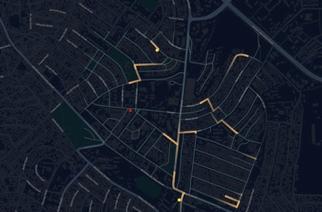

# Concepts

A **simulation** is the execution of a *model* (representation of a system) in a predefined *scenario*. 

The **scenario** consists of configurations of certain aspects like:

- the simulation time frame (start and endpoint) 
- the tick size (in our tick-based-system every tick represents a time frame; the simulation is executed tick by tick)
- the number of involved agents
- input data that is used in the model to initialize or update agents, entities and layers

Every scenario, therefore, consists of a **model description** that defines which parts of the model are part of the scenario (e.g. which layers and agents are involved) and the mentioned simulation config.

The model is described by the concept of agents, entities and layers.

## Agents

[Agents](../development/agent.md) are independent and active components that can sense surroundings and act upon these findings and their internal state (memory, goals, desires, …).

## Entities

[Entities](../development/entity.md) are like agents components with a life-cycle (they are created initially, initialized with data and eventually removed from the simulation later). Unlike agents, they cannot act. They, therefore, represent model objects that exist in the model and can be used by the agent. 

## Layers

[Layers](../development/layers.md) could be described as playgrounds of the simulation if you would describe agents as players. They provide information for certain aspects of the model and can be used by agents to acquire tempo-spatial data or provide an interface for exploring entities or other agents. There is a specific bond between agents and their main layer, initially provided to the agent on initialization. This layer may be responsible for creating the agent with an `AgentManager`.

## Tick

Single time step of a simulation of a MARS model. For each Tick each agent will execute its logic, like movement or updating behavioral states. The tick can either be based on a **real time** (i.e. from 9 AM to 5 PM, with each tick representing one second), or more **abstract a succession of steps**, as in a move on a chess game.

## Model types

On important aspect you need to define before starting to create your model is the *type* of your model: will your agents move on more abstract area, as in a simple grid-cell matrix, or do have *real world* simulation area with streets, places and landscapes?

| Grid                     | Real-world free movement   | Real-world street network     |
| :----------------------: | :------------------------: | :---------------------------: |
|  |  |  |

### Grid

Grid based models are easier to set up and develop. Your agents move on an abstract Cartesian coordinate grid. The grid cells can have different properties, i.e. some cells might walkable and some not. 

This type is especially well suited for small encapsulated simulation areas, like people moving in a building/room or for an abstract scenario where the actual geographic location is not relevant.

:::tip

See our starter model for grid based simulations: https://github.com/MARS-Group-HAW/blueprint-grid

:::

### Real-world

Real-world based basically moves the grid based system into the *real-world*. You can imagne the grid put on top of a specific area in the world. Some examples where this might be usefull is to simualte animal movements inside a park.

:::tip

See our starter model for elephant movements in the Addo Elephant Park in South Africa: https://github.com/MARS-Group-HAW/blueprint-georaster

:::

### Real-world street network

If your model depends on real-world information, like actual street networks or point of interests like restaurants or offices, this type is for you. 

Though the preparation and integration of such data is a bit more complex. 

:::tip

See our starter model for people moving on streets and looking for restaurants: https://github.com/MARS-Group-HAW/blueprint-geovector

:::

## Example: Wolf-Sheep

Check out the [Wolf-Sheep-Model](https://github.com/MARS-Group-HAW/model-wolf-sheep) to make yourself familiar with the [basic concepts](../development/model.md), like [layers](../development/layers.md) and [agents](../development/agent.md).

The folder `WolfSheepPredation` contains a simple predation model in which sheep and wolves move on a grid. `Sheep` eat grass and periodically increased by a `GrassGrowthAgent`. `Wolf` hunt sheep and eat them if close enough. Both animals reproduce eventually by losing half their energy. Energy is also consumed in every tick and can be replenished by eating food. If the energy is zero, the animal dies.

The design concepts can be found in the `Design`-folder.

The following tutorial video explains the relevant aspects of that model in more detail:

<iframe width="560" height="315" src="https://www.youtube.com/embed/QmOmuCkAXUg" title="YouTube video player" frameborder="0" allow="accelerometer; autoplay; clipboard-write; encrypted-media; gyroscope; picture-in-picture; web-share" allowfullscreen></iframe>

The repository also contains a second folder `WolfSheepGrassPredation` that promotes `Grass` to an own agent type that can vary in growth. Further concepts are introduced and are explained in a second tutorial video.

<iframe width="560" height="315" src="https://www.youtube.com/embed/GEUd4b2-Eq4" title="YouTube video player" frameborder="0" allow="accelerometer; autoplay; clipboard-write; encrypted-media; gyroscope; picture-in-picture; web-share" allowfullscreen></iframe>
