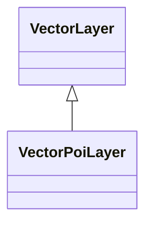
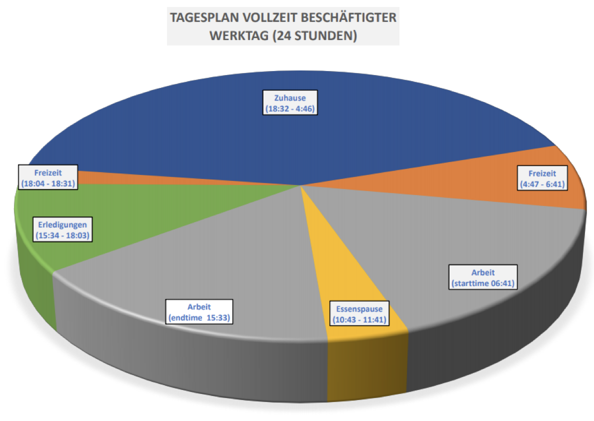

# Agents

SmartOpenHamburg uses agents to map mobility behaviour. The system offers different pre-defined types that can be used to investigate different scenarios. Existing types can be reused, and new classes can be defined. 

The model includes the following agent types:

* MultiCapableAgent
* MultimodalAgent
* Pedestrian
* Citizen
* Traveler
* Driver
* Cyclist
* FerryDriver
* DockWorker

SmartOpenHamburg implements the following execution models. Further models such as endless _drive_, _random drive_ exist or can be enforced by the user. 

## Source-Destination Model

This mode creates concrete ``Traveler`` agents that start from a source and move towards a target. On the way, travellers can use different available modalities to reach their destination. 

A Traveler Agent is a specialization of the ``MultiCapableAgent`` (more about this type of agent can be found [here](multi_capable_agent.md))

Planning is done based on the destination concerning the static travel time of identified ``MultimodalRoute``s. A multimodal route consists of several subroutes, each assigned to an individual modality.
The ``Traveler`` tries to obtain, use and return these modalities on the way.

## Daily Schedule Model

This mode uses a generated daily schedule that is processed by concrete or derived `Citizen` agents. A daily schedule includes multiple entries of the following categories:

|Category|Description|
|--------|-----------|
|_Work_|Describes a unit of work of the agent he is following. 
|_Errands_|Describes various non-work-specific types of tasks that do not involve free time.
|_Freetime_|Describes blocks of time in which leisure activities are taken (this can also be at home).
|_Eat_|Describes units in which utility services are consumed.
|_Home_|Describes units to which agent is at home.|

Each category leads to different destinations via a service catalogue, using a point-of-interest layer. `Citizen`s consume services there and move to the next destination depending on time.  
 
The following table shows a schedule configuration for everything `Citizen`. Each cell specifies a probability, in how far the respective agent fills out the given category in his schedule within the defined period ``from`` and ``until``, giving the lower and upper hour bound within the day:  
  
|from|until|to_work|to_errands|to_freetime|to_eat|to_home|
|----|-----|-------|----------|-----------|------|-------|
|5|8|60|4|3|9|2|
|8|10|19|19|10|18|5|
|10|13|8|28|20|23|19|
|13|16|7|25|27|23|24|
|16|19|2|19|27|20|32|
|19|22|1|4|11|6|13|
|22|5|3|1|2|1|5|

The diary creates a dynamic history in the attached image.

<figure>

<figcaption>

For _half-day_ or _non-working agents_, either the second work block after the lunch break or the complete work block is omitted.
</figcaption>
</figure>