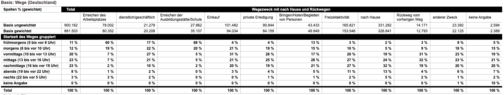
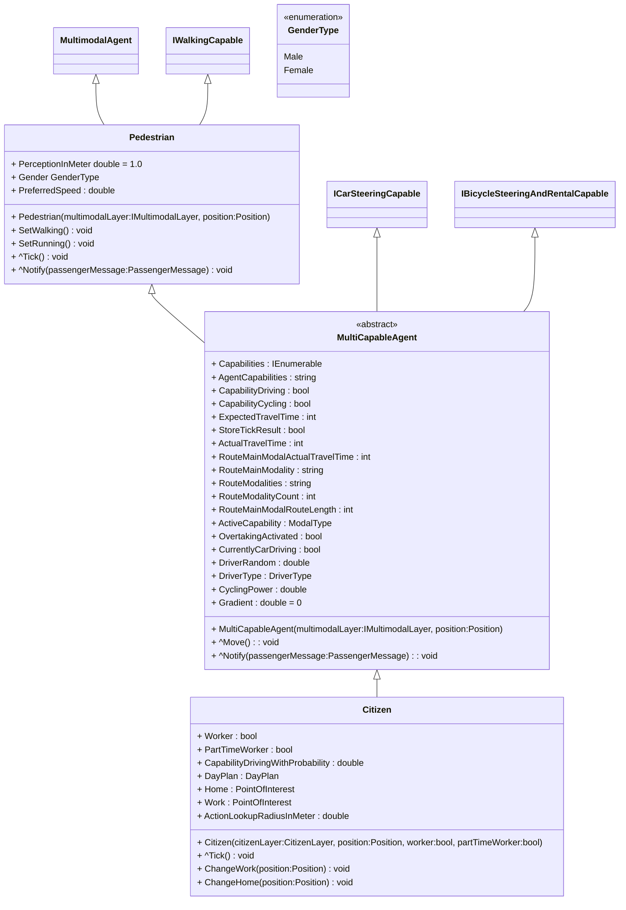

# Citizen

The ``Citizen`` agent is a [``MultiCapableAgent``](multi_capable_agent.md) that has a dayplan of activities over the day at different locations.
The dayplan is generated by statistical distribution (see figure below) depending on the properties ``Worker`` and ``PartTimeWorker``.

*Source: [Mobilität in Deutschland](https://mobilitaet-in-tabellen.dlr.de/mit/)*

On the start point in time of a new action the ``Citizen`` moves to the wanted location. The agent may use different transportation devices depending on its capabilities (see [``MultiCapableAgent``](multi_capable_agent.md)) and the availability of vehicles in the current surrounding (see  [``MultimodalLayer``](../layers/multi_modal_layer.md)).

