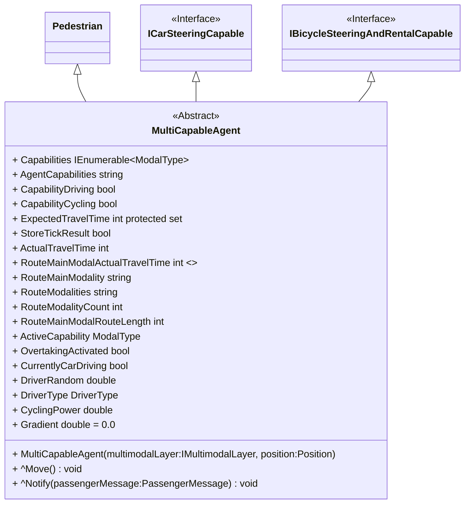

# Multi-Capable Agent

The ``MultiCapableAgent`` agent is a [``MultimodalAgent``](multi_modal_agent.md) that implements different steering capabilities.
As right now it supports car driving (``ICarSteeringCapable``) and cycling (``IBicycleSteeringAndRentalCapable``). 
Moreover, it allows to use the [``ferry``](../entities.md#ferry) and walking (``Pedestrian``). 



## Dynamic capabilities

The ``MultiCapableAgent`` agent can be configured by enabling and disabling these capabilities so that different agents (of the same type) may have different modalities at hand to choose from.  
The capability for car driving can be set with over the property ``CapabilityDriving`` and for cycling with ``CapabilityCycling``.

## Output aggregation

The result output as simulation results can be generated for each individual agent to perform detailed analysis.
For bigger scenarios it might make sense to switch to an aggregate output. The ``MultiCapableAgent`` allows to only store information for successfully finished multimodal routes.

As aggregate data following information is provided:

|property                       |description                                                      |
|-------------------------------|-----------------------------------------------------------------|
|ExpectedTravelTime             |An estimation on the required time to travel the multimodal route                                   
|ActualTravelTime               |The required time to travel the full multimodal route                                             
|RouteMainModality              |If the multimodal route has different modalities then the one which allows the fastest travel is the main modality                                        
|RouteMainModalActualTravelTime |The required time to travel the main modality part of the multimodal route                                     
|RouteMainModalRouteLength      |The length of the main modality route                                     
|RouteModalities                |An overview over different sections/subroutes (e.g. Walk:arrow_right:Cycle:arrow_right:Walk) of the multimodal route                                            
|RouteModalityCount             |The amount of different route sections (e.g. Walk:arrow_right:Cycle:arrow_right:Walk = 3)                                             


To activate the multimodal route aggregation output use following definition in the `config.json`.

```json
{
    "agents": [
      {
         "name":"MyAgent",
         "output":"csv",
         "outputFilter":[
            {
               "parameter":"StoreTickResult",
               "operator":"in",
               "values":[
                  true
               ]
            }
         ]
      }
    ]
}
```