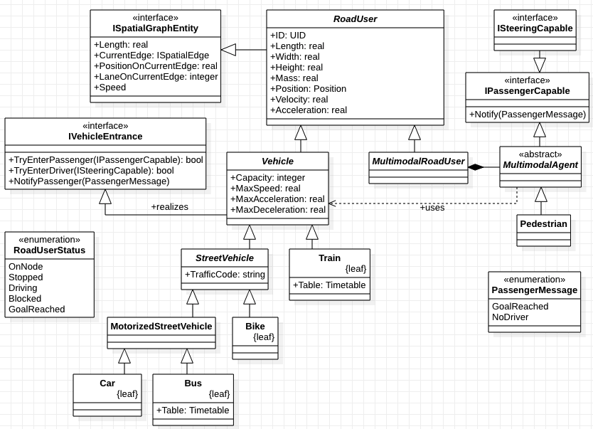

# Multimodal Agent

The ``MultimodalAgent`` agent can handle any modal type and thus any change between modal types. It has a representational ``MultimodalRoadUser`` that holds physical sizes and is placed in the environment.
This agent is the basis of all agents that may switch between different modalities. 
The classic subtype is the ``Pedestrian`` that allows to move by foot on a graph.

## Capabilities

A subtype agent of the ``MultimodalAgent`` may implement any steering capability. The [``MultiCapableAgent``](multi_capable_agent.md) implements ``Walking``, ``CarDriving``, ``Cycling`` and ``FerryDriving``. Every capability (transportation modality) requires a specialiced ``ISteeringCapable`` interface (e.g. ``ICarSteeringCapable``, see figure below), which defines method and properties that this agent must offer to be able to steer such a ``Vehicle``.
Besides steering the vehilce the agent may also use some vehicles as a passenger (e.g. using the [``Ferry``](../entities.md#ferry)). The ``IPassengerCapable`` is implemented by the ``MultimodalAgent`` and informs the agent with a ``PassengerMessage`` about the current status of the drive. It may for instance notify the agent at every stop (e.g. ``FerryStation``) so that the agent may decide to leave or stay on the ferry.

Further information can be found at the [``steering concept``](../steering.md) page.
