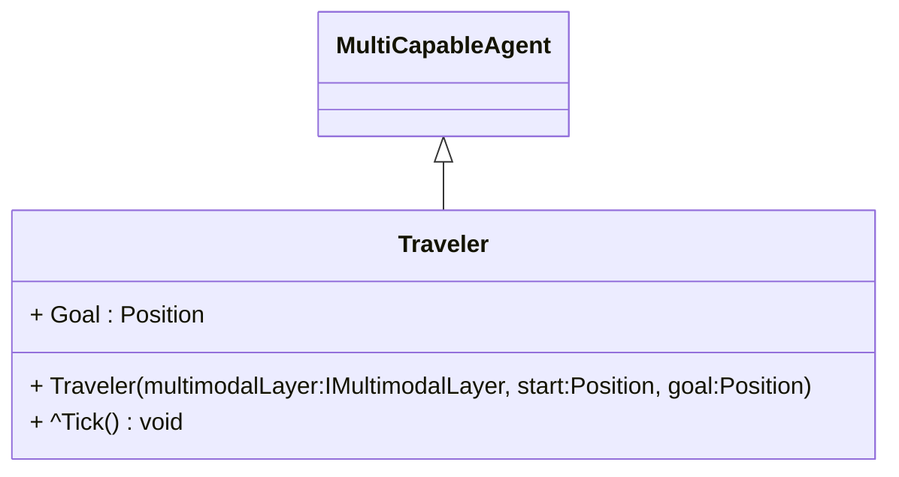

# Traveler

A traveler agent tries to move from start to goal. He/she may use different modalities for that purpose.
The agent removes himself/herself from the simulation after fulfilling this task. 

Concrete travelers are the ``DockWorker`` and `CycleTraveler`.