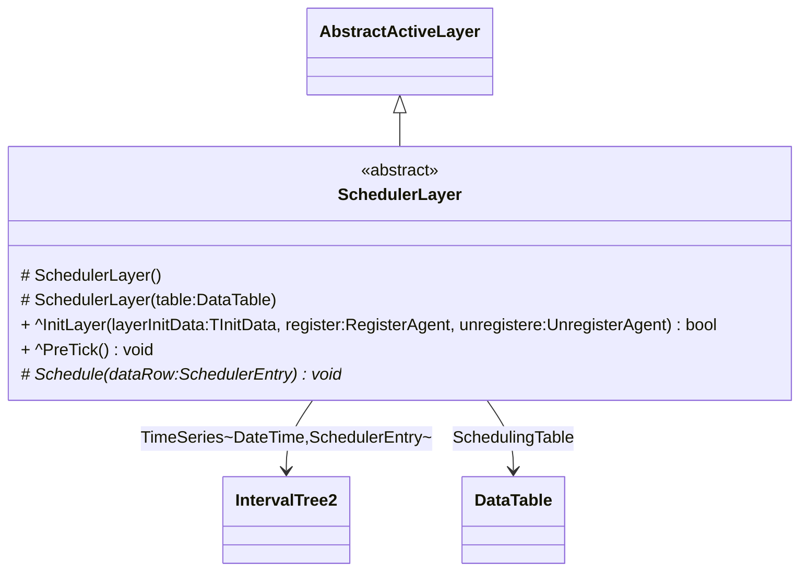
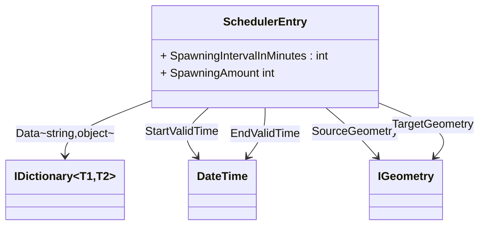

# Scheduler Layer

The scheduling layer can be used to connect time events to specific locations. Such an event can be used for event management or the creation of new agents.

The model for the `SchedulerLayer` looks like this:




The `SchedulerLayer` is an **active** layer (more about active layers can be found [here](../../development/layers.md)) and queries the `TimeSeries` depending on the current simulation time.

The layer manages a time series to several profile data containing a source geometry and optionally a target geometry. 

:::note
Compared to concrete input CSV for the creation of agents, agent profiles can be defined to avoid having to prepare concrete instances with individual parameterization.
:::

## Definition of Scheduler Layer

To define your own scheduling layer, you have to define a new class which inherits from the abstract class ``SchedulerLayer``.

First, a `using` import of the namespace has to be done:

```csharp
using SOHDomain.Common;
```

Now a new class can be defined that inherits from the `SchedulerLayer`. As soon as an inheritance hierarchy has been defined, the method `Schedule` is expected to be implemented:

```csharp
public class MySchedulerLayer : SchedulerLayer 
{
    public override void Schedule(SchedulerEntry dataRow) 
    {
        // do your scheduled logic here
    }
}
```

The `Schedule` method is called exactly when there is an entry with a valid period. A `SchedulerEntry` is passed with the call which contains the content of the entry from the table which is valid at this time.

The model for the `SchedulerEntry` looks like this:



## Scheduling Layer parameters

The `SchedulerLayer` expects a tabular input of the form:

|startTime|endTime|spawningIntervalInMinutes|spawningAmount|sourceX|sourceY|destinationX|destinationY|
|---------|-------|-------------------------|--------------|-------|-------|------------|------------|
|7:00|18:00|30|1|9.95253|53.54907|9.92812|53.52143|
|5:00|14:00|60|2|9.91582|53.54836|9.92797|53.50674|
|16:00|23:00|60|2|9.97033|53.54898|9.949668|53.531397|
|9:00|20:00|10|2|9.98911|53.54531|9.891536|53.534310|
|6:00|9:00|10|4|9.87707|53.53461|9.97969|53.54480|

* The ``startTime`` (including) and the ``endTime`` (exclusive) each indicate the lower and upper interval bounds in hours of the day. It defines the time range of the day when new scheduling is triggered in the simulation.
* The ``spawningIntervalInMinutes`` (e.g. ``30``, for every half hour) allows to repeat the creation of scheduling events starting with the ``startTime``.
* The ``spawningAmount`` of scheduling event. Describes how often the `Schedule` method should be called when a valid time is reached.
* To describe spawning source-target location, the scheduler offers two different parameterizations:
  * A concrete source and destination coordinate can be defined in ``WGS84:4326`` notation via the fields ``sourceX`` (longitude) and ``sourceY`` (latitude) for the source and ``destinationX``(longitude) and ``destinationY`` (latitude) for defining an **optional** target (e.g. ``9.95253, 53.54907``).
  * A source geometry can be defined via the ``source`` field (see polygon areas in the figure above) using the ``WKT`` (well-known-text) format with ``WGS84:4326`` notation to designate areas, lines, and points in the simulation world (e.g. B. ``POLYGON((9.976880157282743 53.5447212390353,9.983403289606962 53.54446623736498,9.980656707575712 53.54240066721653,9.976880157282743 53.5447212390353))``). For lines and polygons (areas) the model selects **equidistributed randomly** a coordinate that either lies along the line or is inside the described area. A helpful tool to define own WKT vector or selecting coordinates is the online [Openlayers](http://dev.openlayers.org/examples/vector-formats.html) tool.

More information in contrast to a specialized `SchedulingLayer` implementation can be provided by using the ``Data`` attribute in the ``SchedulerEntry``.

## Scheduling for Agent Creation

The `SchedulingLayer` can be used directly to create agents. In the `Schedule` implementation, agents can be created directly by calling the `new` constructor. 

```csharp
public class CycleTravelerSchedulerLayer : SchedulerLayer
{
    public TravelerLayer TravelerLayer { get; set; }

    protected override void Schedule(SchedulerEntry dataRow)
    {
        var source = RandomPositionFromGeometry(dataRow.SourceGeometry);
        var target = RandomPositionFromGeometry(dataRow.TargetGeometry);


        var traveler = new Traveler(TravelerLayer, source, target)
        {
            ResultTrajectoryEnabled = true
        };

        TravelerLayer.Travelers.Add(traveler.ID, traveler);
        RegisterAgent(TravelerLayer, traveler);
    }
}
```

The above example creates a new `Traveler` agent for each valid event, registers it with the runtime system and adds it to the layer.