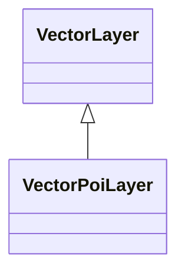
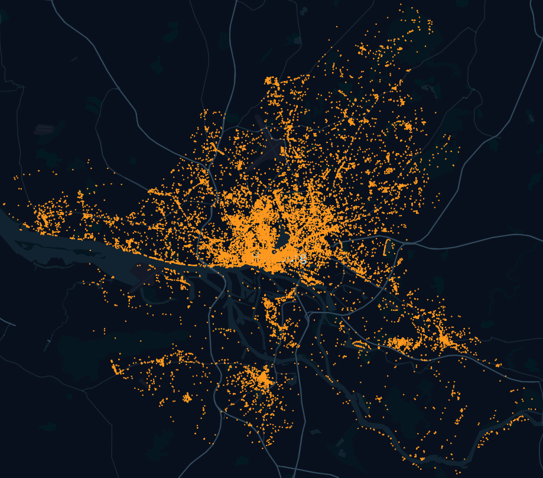
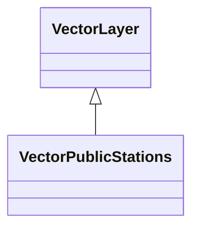
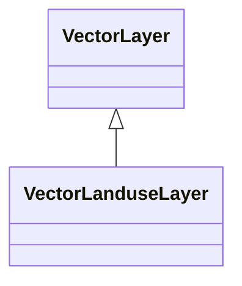
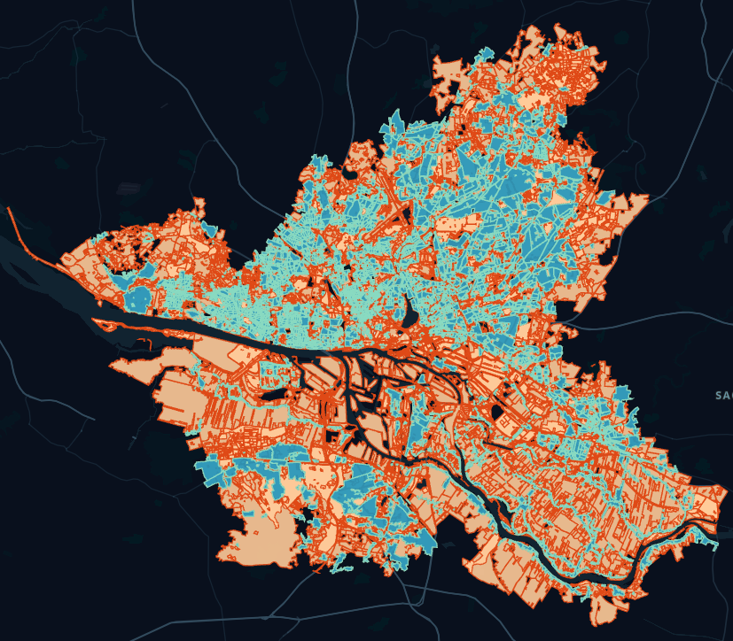
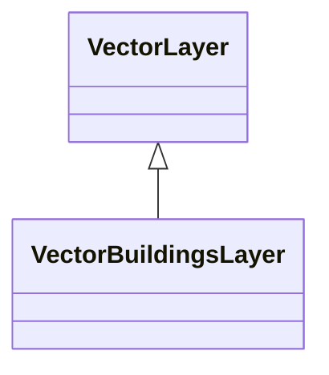
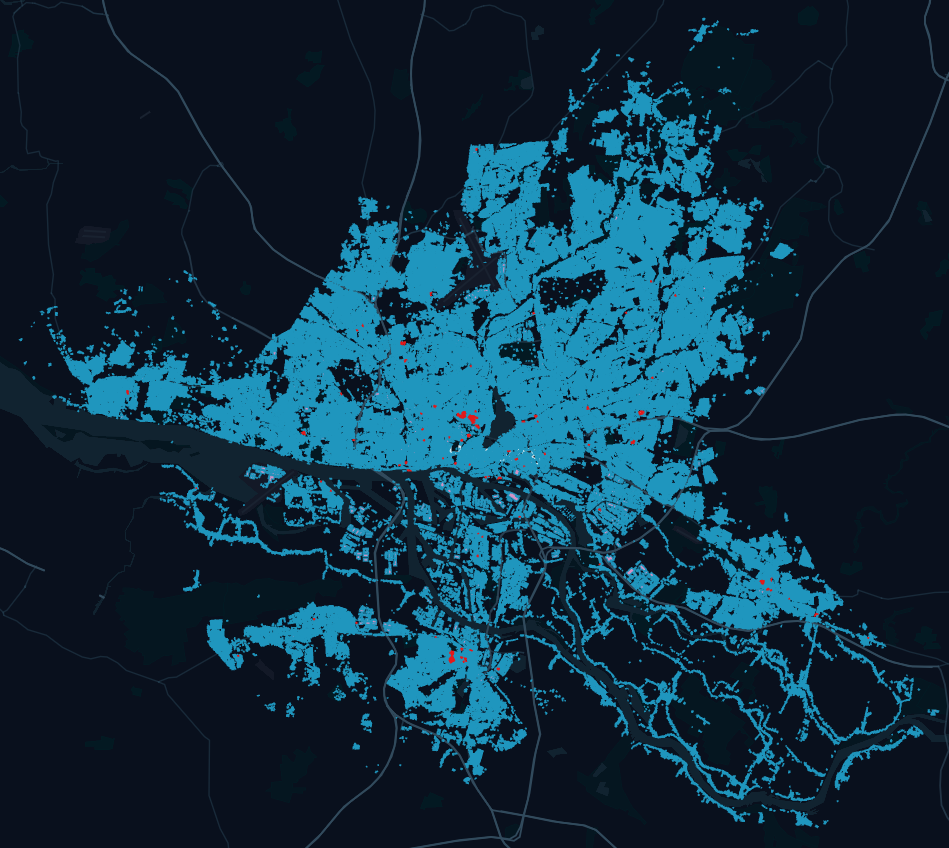
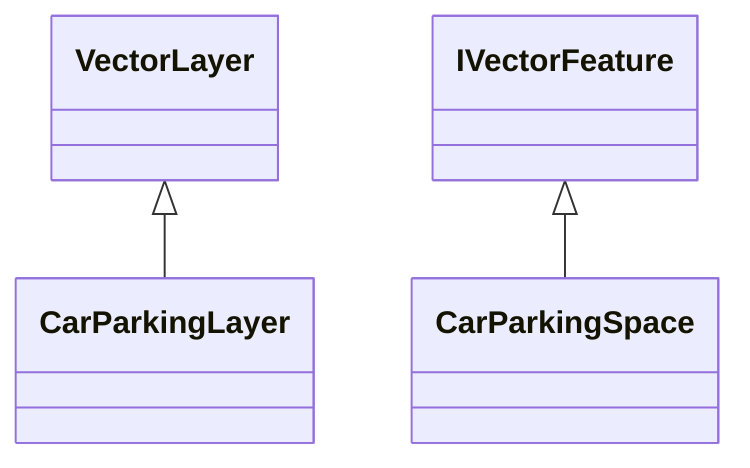

# Vector Layer

The SmartOpenHamburg model implements a number of vector-layers (more about vector-layers and how to define them can be found [here](../../development/layers.md)).

Vector layers are used in the model to map environmental information of the city. This environmental information includes the following types:

* Point Layer
    * Point of interests
    * Public transport stations
* Polygon Layer
    * Landuse Layer data
    * Buildings footprints
* Line Layer
    * Walk network 
    * Drive network
    * Bicycle network

## Point of Interests

The `VectorPoiLayer` (POI) is a point layer that includes service points. It supports the [Daily Schedule Model](../agents/agents.md#daily-schedule-model) of the Citizen Agents. 




The `VectorPoiLayer` is used to fulfill the `Freetime` category.



## Public Transport Stations

The public transport layer is a point layer that includes public train stations, bus stops and landing stages, decoupled from the `POI` layer. It can be used to identify multimodal routes for public transport.




## Landuse Layer



Der Landuse Layer wird verwendet um Service Gebiete in der Stadt zu identifizieren, anhand dere der Tageplan des `Citizen` Agenten ausgelegt werden kann. Er enthält weitere nicht nach Service Punkten benannnte Orte wie Grünflächen oder Inndustrie Bezirke. Desweiteren wird er verwendet um Wohnsitutation in der Stadt abzubilden um daraus die `Home` Lokalität im Tagesplan zu ermitteln.



Die obige Abbildung zeigt den Landuse Layer mit hervorgehobenen `residential` (blau) Bezirken und allen anderen Bezirken (orange). 

K-NN Anfrange könen an den `VectorLanduseLayer` gestellt werden um nach naheliegenden Grünflächen zu suchen:

```csharp
var nearestLands = VectorLanduseLayer.Explore(new []{9.941650, 53.587268}, 100, 1, land => land.Type == "grass");
```

## Buildings Footprint

The Buildings Footprint is multi-polygon based layer and represents the positioned buildings of the city to support the categories for using the [Daily Schedule Model](../agents/agents.md)




A `VectorBuildingsLayer` can be used similar to the `VectorLanduseLayer` to search for nearby service locations. The following figure shows the integrated buildings' footprint of Hamburg, highlighting the universities (red):



The following code searches for a supermarket to fulfill `Errands`:

```csharp
var nearestShops = VectorLanduseLayer.Explore(new []{9.941650, 53.587268}, 100, 1, buildings => land.Type == "supermarket");
```

## Modality Networks

To map the areas in which agents can move and to differentiate within the modality route planning, a separate network is provided for each available modality.
Networks are integrated at runtime and implemented in the model by the ``SpatialGraphEnvironment``.

We differentiate between several nets, since certain routes are only passable for a subset of modalities to a limited extent. The following picture shows the integrated network for vehicle and walk modality:


The walk network is managed by the ``CitizenLayer`` for the walk modality, the ``CarLayer`` for the drive modality and the ``BicycleLayer`` for the bicycle modality. The networks contain the moving agents can be queried against other agents, obstacles or to resolve multi-modality routes.  

## CarParkingLayer

A `CarParkingLayer` is a `VectorLayer` that holds `CarParkingSpaces`.




It can be filled with data that hold the geocoordinates of parking areas and parking spaces. Each feature of the imported vector layer maps to one `CarParkingSpace` in the `CarParkingLayer`. Below is a screenshot of a vector layer in QGIS that shows the geocoordinates of parking areas and parking spaces in the inner city of Hamburg, Germany.


A `CarParkingLayer` offers methods for managing and interacting with `CarParkingSpace` objects. Below are some examples:

* `Nearest(position, freeCapacity=true)`: returns the `CarParkingSpace` with shortest distance to `position`. The parameter `freeCapacity` is optional and denotes if the requested `CarParkingSpace` should be free at the time of calling (if it is set to `false`, the method will return the `CarParkingSpace` that is closest to `position`, regardless of its occupation status at the time of calling).
* `Explore(position=null, maxDistance=-1, freeCapacity=true)`: returns a list of `CarParkingSpaces` with shortest distance (in ascending order) to `position`. If `position` is not specified, the method uses the geocoordinates of the calling agent. `maxDistance` is optional and denotes the radius in which the exploration should occur. `freeCapacity` is also optional and denotes whether the returned `CarParkingSpace` objects should be free at the time of calling (if it is set to `false`, the method will return all `CarParkingSpace` objects within the exploration radius, regardless of their occupation status at the time of calling).

### CarParkingSpace

Each feature of the imported vector layer maps to one `CarParkingSpace` in the `CarParkingLayer`. A feature of a vector layer contains an attribute _area_ (in m²) which is used by the `CarParkingLayer` to compute the `Capacity` of each `CarParkingSpace`. `Capacity` has three categories:

* If `Capacity < 10`, then the `CarParkingSpace` has space for a single `Car`
* If `10 <= Capacity < 500 `, then the parking area of the `CarParkingSpace` is divided into parking spaces of 15 m² each
* If `Capacity >= 500`, then the parking area of the `CarParkingSpace` is divided into parking spaces of 20 m² each 

A `CarParkingSpace` object can be interacted with via several methods. Below are some examples: 

* `HasCapacity`: returns whether the `CarParkingSpace` currently has free parking spaces
* `Enter(Car)` and `Leave(Car)`: can be used by the calling agent to enter or leave (respectively) the `CarParkingSpace` with his/her `Car`

### Interaction with Parking Spaces at the Beginning and End of a Trip

A trip of an agent who travels from point `A` to point `B` using a `Car` can be divided into three sections (broadly speaking):

1. Travel on foot from `A` to the position of the `CarParkingSpace` that holds the `Car`
2. Travel from the position of the `CarParkingSpace` to the `CarParkingspace` with shortest distance to `B` for which `HasCapacity == true`
3. If the `CarParkingSpace` is still free upon the agent's arrival, it is occupied and the agent moves on foot from its position to `B`. If the `CarParkingSpace` has is occupied upon arrival, the agent will search for the `CarParkingSpace` with shortest distance to his/her current position.