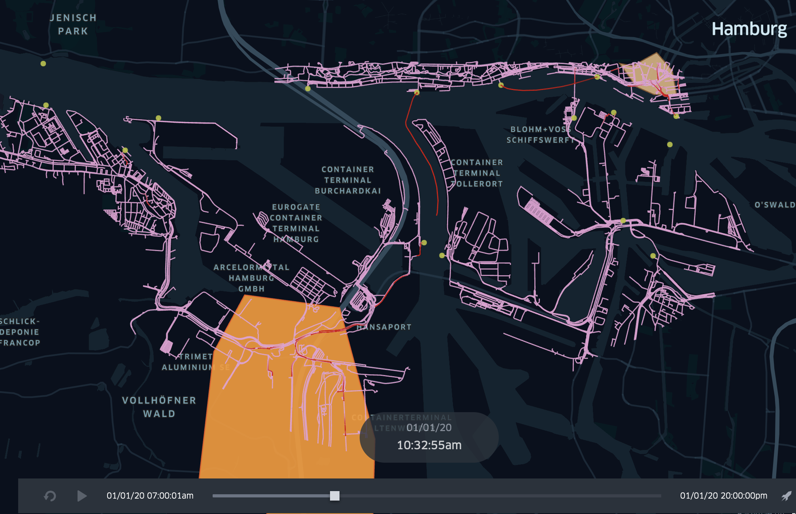

# FerryTransfer

* [:floppy_disk: **Windows**](https://git.haw-hamburg.de/mars/model-deployments/-/raw/master/SOHFerryTransfer/SOHFerryTransfer_WINDOWS.zip)

* [:floppy_disk: **MacOSX**](https://git.haw-hamburg.de/mars/model-deployments/-/raw/master/SOHFerryTransfer/SOHFerryTransfer_MACOSX.zip)

* [:floppy_disk: **Linux**](https://git.haw-hamburg.de/mars/model-deployments/-/raw/master/SOHFerryTransfer/SOHFerryTransfer_LINUX.zip)

The _FerryTransfer_ scenario creates a crowd of moving dock workers moving from a specified source point towards a specified target such as a randomly selected container terminal. They move within walking distance and use available ferry services that stop at the docks at regular intervals. 
The default setup in each box is shown in the following figure.



Ferries and dock workers move along the ferry lines and public sidewalks. Timings of ferries, new or re/moved ferry stations can be investigated to optimize the flow of passengers. 

The result schema and configuration of this scenario is described [here](ferry_transfer_green4bikes_results.md).

### Start the Simulation

To run this scenario follow the instructions of your operating system.

##### Windows &#10024;
For Windows users, start the box by calling the following command (the config.json-file in the same folder is used):

```bash
   SOHFerryTransferBox.exe
```
    
Optionally a different external simulation config can be used with the ``--sm`` parameter:

```bash
   SOHFerryTransferBox.exe --sm config.json
```
    
##### Unix, Mac, Linux &#10024;

To start the box on Unix-based systems, execute the following command (the config.json-file in the same folder is used):

```bash
    ./SOHFerryTransferBox
```


Optionally a different external simulation config can be used with the ``--sm`` parameter:

```bash
   ./SOHFerryTransferBox --sm config.json
```

 ---
> &#10071;&#10071;&#10071; There may be problems with the verification of the box and additional files with the extension ``*.dylib`` and ``*.dll``. Please execute the following command to make them accessible in your terminal:
 ```bash
xattr -d com.apple.quarantine ./SOHFerryTransferBox
```
---
As soon as the box starts, it shows you the current parameterization and stops the simulation. 
Results are stored as trajectories of the agents and can be visualized.

The following video shows an example scenario for simulating `DockWorker` using the `Ferry`` traffic to move towards a randomly selected target in the Hamburg harbour area: 

> [!Video https://www.youtube.com/embed/muBlvUj2jwA]


#### Dock Worker Scheduling 


Dockworkers can be created at runtime of the simulation and can be set with source and destination coordinates. We use so-called agent profiles for scheduling, which represent several categories of dockworkers, to keep the setting of the scenario as simple as possible.
 
 * The ``startTime`` (including) and the ``endTime`` (exclusive) each indicate the lower and upper interval bounds in hours of the day. It defines the time range of the day when new dockworkers are created in the simulation and should move towards a target.

* The ``spawningIntervalInMinutes`` (e.g. ``30``, for every half hour) allows to repeat the creation of new dockworkers from the ``startTime``. It specifies, after how many minutes new dockworkers should be created.

* The number of Dockworkers created can be set using the ``spawningAmount`` field (e.g. ``3`` for three new workers) 

* To describe spawning location and the moving target, the scheduler offers two different parameterizations:
    * A concrete source and destination coordinate can be defined in ``WGS84:4326`` notation via the fields ``sourceX`` (longitude) and ``sourceY`` (latitude) for the source or ``destinationX``(longitude) and ``destinationY`` (latitude) for defining the movement target (e.g. ``9.95253, 53.54907``).
    * A source geometry can be defined via the ``source`` field (see polygon areas in the figure above) using the ``WKT`` (well-known-text) format with ``WGS84:4326`` notation. It designates areas, lines, and points in the simulation world (e.g. B. ``POLYGON((9.976880157282743 53.5447212390353,9.983403289606962 53.54446623736498,9.980656707575712 53.54240066721653,9.976880157282743 53.5447212390353))``). For lines and polygons (areas) the model selects **equally distributed randomly** a coordinate that either lies along the line or is inside the described area. A helpful tool to define own WKT vector or selecting coordinates is the online  [OpenLayers](http://dev.openlayers.org/examples/vector-formats.html) tool.

A full example of such a scheduling configuration is showed below and describes the setting above:

|startTime|endTime|spawningIntervalInMinutes|spawningAmount|gender|mass|perceptionInMeter|source                                                                                                                                                                                                                                                                                       |destination                                                                                                                                                                                                                                                                                                                     |
|---------|-------|-------------------------|--------------|------|----|------------------|---------------------------------------------------------------------------------------------------------------------------------------------------------------------------------------------------------------------------------------------------------------------------------------------|--------------------------------------------------------------------------------------------------------------------------------------------------------------------------------------------------------------------------------------------------------------------------------------------------------------------------------|
|7:00     |18:00  |10                       |10            |female|60  |1.0               |MULTIPOLYGON (((9.97859976984082 53.543765731511,9.98209851718183 53.5428480272904,9.98651496874344 53.5427906707766,9.98565462103663 53.5456584964659,9.98261472580592 53.5477233309623,9.97791149167537 53.54617470509,9.97538780506874 53.546461487659,9.97859976984082 53.543765731511)))|MULTIPOLYGON (((9.9038642323762 53.4969628162607,9.91063230100308 53.4898506085511,9.92686419440484 53.4863518612101,9.92760982908407 53.502813180667,9.92072704742962 53.5180700133344,9.90220089347638 53.5195612826928,9.89617845952873 53.5129652836073,9.89331063383937 53.498224659564,9.9038642323762 53.4969628162607)))|

Since dockworkers are simply pedestrians. Pedestrian movement can be configured additionally to affect walking and running speed, by specifying `gender`, `mass` or the `perceptionInMeter`.

#### Ferry Vehicle Configuration
Ferry vehicles can be parameterized by their passenger capacity (see example below or ``ferry.csv``). The capacity describes how many passengers (here DockWorker) can use the ferry at the same time. Suppose the amount of waiting passengers exceeds the capacity. In that case, the remaining passengers have to wait for the next ferry to come.
Dimension properties are not part of the ferry model (so every ferry type may reach every station in comparison to the real-world situation). 
Moreover, the associated moving properties are not included because the ferry velocity is based on the defined travelling time (see **Ferry Line Configuration**).

|type     |passengerCapacity |
|---------|------------------|
|Typ2000  |250               |


#### Ferry Line Configuration
Ferries can only drive on predefined ferry lines (routes). These lines have to be defined in the ``ferry_line.csv`` (see example below).
The table contains a list of stops. The column line identifies all associated stops of the same line. 
The station_id identifies a ferry station by its id. The id is a feature property of every point geometry and can be found in the ``hamburg_ferry_stations.geojson``. 
Minutes defines how much time is required to reach this stop from the previous one (so the ferry requires 7 minutes from ``80984`` to ``53988``). The first stops minutes is 0 because it has no predecessor.

|line     |station_id |minutes|
|---------|-----------|-------|
|75       |80984      |0      |
|75       |53988      |7      |
|75       |80984      |5      |


#### Ferry Driver Configuration
 
To now let a ferry driver perform such a ferry drive on a define ferry line, the driver has to be spawned. This works quite similar to the spawning algorithm of the **Dock Worker Scheduling**.
Every ferry driver executes one line and is removed from the simulation. In the example below (also see ``ferry_driver.csv``) drivers are spawned for line 61. They, therefore, move their ferry along the given route of this line (see **Ferry Line Configuration**).
Within the given period (``startTime`` to ``endTime``) drivers are created periodically with the given interval (``spawningIntervalInMinutes``). In providing an example starting at 5 o'clock every 10 minutes, a driver starts to perform line 61.
The parameter ``minimumBoardingTimeInSeconds`` describes how many seconds the ferry will at least wait at every station for exchange of passengers.
The parameter ``spawningAmount`` defines how many drivers start simultaneously.


|line|startTime|endTime|spawningIntervalInMinutes|minimumBoardingTimeInSeconds|spawningAmount|gender|mass|perceptionInMeter
|----|---------|-------|-------------------------|----------------------------|--------------|------|----|------------------|
|61  |5:00     |18:00  |10                       |20                          |1             |female|60  |1.0               |

#### Station Re-/placement

To adding, removing, or move ferry stations, two GeoJSOn files have to be modified.
Therefore open the `hamburg_ferry_stations.geojson``-a file that contains all stations. It can either be modified with an editor or imported in a  Geographic Information System (GIS, e.g. [QGIS](https://qgis.org/en/site/forusers/download.html)) for further modification.
In the following example, a new station is inserted using QGIS. 
After importing the file mentioned above the editing, status has to be switched to editing (_yellow pen_). 

 

Then a new point-object can be inserted at the desired position (three green points-symbol). This now requires an ID and a short_name. Afterwards save the modified layer (save icon, see above).

 

The second part requires to connect the new station with the ferry graph. Therefore the ``hamburg_ferry_graph.geojson`` can be imported into QGIS. It displays the graph that connects all stations. 
To get the new station to be connected, a line has to be drawn from an existing station to the new one. Beware that the line may really click the two geo points (so zoom in to be sure).
The result may look like this.

 

Finally, the station can be used in a ferry line (see **Ferry Line Configuration**). Add a ferry line-entry and reference the station id that was assigned.

|line     |station_id |minutes|
|---------|-----------|-------|
|75       |80984      |0      |
|75       |53988      |7      |
|75       |80984      |5      |
|61       |80984      |0      |
|61       |80980      |5      |
|61       |80989      |5      | 
|61       |52981      |9      |
|61       |53990      |3      |
|**61**   |**99999**  |**3**  |
|61       |53990      |3      |
|61       |52981      |3      |
|61       |80989      |12     |
|61       |80980      |4      |
|61       |80984      |8      |

This results in ferry driver that commute on line 61 to also reach the new station within their trip (see below).


 
 ---
 ### Result Analyse
 
 Details for the result schema and output can be found [here](ferry_transfer_green4bikes_results.md).
