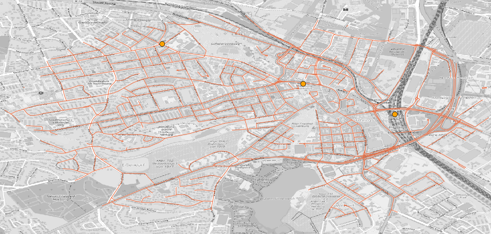

import Tabs from '@theme/Tabs';
import TabItem from '@theme/TabItem';

# Green4Bikes

[💾 Download of the model](https://github.com/MARS-Group-HAW/model-soh-green4bikes/releases)
 
Green4Bikes simulates the use and consumption of bicycle rental stations in the area around Harbuger Central Station. It will simulate individual inbound and outbound pedestrian traffic where pedestrians use available public bicycles on their way to their mobility destination.

The choice for a bicycle depends on the travel cost savings. If no bicycles are available, the destination must be reached on foot.


## Start the simulation

To run this scenario follow the instructions of your operating system.


<Tabs>
<TabItem value="mac_linux" label="macOS & Linux" default>

To start the box on Unix-based systems, execute the following command (the `config.json`-file in the same folder is used):

```bash
./SOHGreen4Bikes
```

Optionally a different external simulation config can be used with the ``--sm`` parameter:

```bash
./SOHGreen4Bikes --sm config.json
```

:::caution
There may be problems with the verification of the box and additional files with the extension ``*.dylib`` and ``*.dll``. Please execute the following command to make them accessible in your terminal:
```bash
xattr -d com.apple.quarantine ./SOHFerryTransferBox
```
:::

</TabItem>
<TabItem value="win" label="Windows">

For Windows users, start the box by calling the following command (the `config.json`-file in the same folder is used):

```bash
SOHGreen4Bikes.exe
```

Optionally a different external simulation config can be used with the `--sm` parameter:

```bash
SOHGreen4Bikes.exe --sm config.json
```
</TabItem>
</Tabs>

---

As soon as the box starts it shows you the current parameterization and stops the simulation. 
Results are stored as trajectories of the agents and can be visualized.

### Rental Station Configuration

New rental stations can be added, moved or removed. The input is done via the `BicycleRentalLayer` which expects a vector file as input.

#### Rental Station Input

In the default scenario, the input for rental stations is available in the ``harbug_rental_staions.geojson``. The GeoJSON file can be modified using any text editor or tool (for example [QGIS](https://www.qgis.org/de/site/index.html), [geojson.io](https://geojson.io/#map=12/53.5599/10.0103)). 

To change the input, the mapping for the `BicycleRentalLayer` must be adjusted in the configuration file:

```json
{
	"name": "BicycleRentalLayer",
	"file": "harbug_rental_staions.geojson"
}
```

#### Rental Station Edition

MARS is able to output agents, entities and data layers (vector and raster). For the `BicycleRentalLayer` this allows the observation of changes at the rental stations and thus the concrete increase and decrease of free bicycles.

To activate the output for the `BicycleRentalLayer`, the desired output type must be set:

```json
{
	"name": "BicycleRentalLayer",
	"output": "geojson",
	"outputFrequency": 1000,
	"file": "resources/harburg_rental_stations.geojson"
}
```

This configuration creates a snapshot every ``1000`` seconds including the initial state. More settings can be found here.

:::note
It is recommended to always set the output frequency of vector and raster layers, because complete output can lead to a longer runtime.
:::

The following video shows an example scenario for simulating `CycleTraveler` using the `RentalBicycle`s and moving towards a specified destination. It shows the fluent decrease and increase of available rental wheels from north to south: 

<iframe width="560" height="315" src="https://www.youtube.com/embed/MR3-RVlWdxw" title="YouTube video player" frameborder="0" allow="accelerometer; autoplay; clipboard-write; encrypted-media; gyroscope; picture-in-picture; web-share" allowfullscreen></iframe>

### Cycle Traveler Scheduling

Traveler can be created at runtime of the simulation and can be configured with source and destination coordinates (equivalent to [Dock Worker](ferry_transfer.md)). We use so-called agent profiles for scheduling, which represent several categories of traveling entities, to keep the setting of the scenario as simple as possible.
 
 * The ``startTime`` (including) and the ``endTime`` (exclusive) each indicate the lower and upper interval bounds in hours of the day. It defines the time range of the day when new cycle traveler workers are created in the simulation and should move towards a target.
* The ``spawningIntervalInMinutes`` (e.g. ``30``, for every half hour) allows to repeat the creation of new traveler from the ``startTime`` to indicate after how many minutes new agents should be created.
* The amount of cycle traveler travelers can be set using the ``spawningAmount`` field (e.g. ``3`` for three new workers) 
* The ``hasOwnBikeProbability`` provides the possibility to create agents that use their own bicycle. The value ``0.0`` let every agent use rental bicycles and the value ``1.0`` gives every agent a personal owned bike. A number in between distributes the possession of bikes (e.g. ``0.5`` let about the half of agents rent and the other half use their own bicycle). Agents with personal bicycles move their complete route with this bike without any walking necessity.

* To describe spawning location and the movement target, the scheduler offers two different parameterization:
    * A concrete source and destination coordinate can be defined in ``WGS84:4326`` notation via the fields ``sourceX`` (longitude) and ``sourceY`` (latitude) for the source and ``destinationX``(longitude) and ``destinationY`` (latitude) for defining the movement target (e.g. ``9.95253, 53.54907``).
    * A source geometry can be defined via the ``source`` field (see polygon areas in figure above) using the ``WKT`` (well-known-text) format with ``WGS84:4326`` notation to designate areas, lines, and points in the simulation world (e.g. B. ``POLYGON((9.976880157282743 53.5447212390353,9.983403289606962 53.54446623736498,9.980656707575712 53.54240066721653,9.976880157282743 53.5447212390353))``). For lines and polygons (areas) the model selects **equidistributed randomly** a coordinate that either lies along the line or is inside the described area. A helpful tool to define own WKT vector or selecting coordinates is the online [Openlayers](http://dev.openlayers.org/examples/vector-formats.html) tool.

A full example of such a scheduling configuration is showed below and describes the setting above:

|startTime|endTime|spawningIntervalInMinutes|spawningAmount|gender|mass|perceptionnInMeter|hasOwnBikeProbability|source                                                                                                                                                                                                                                                                                       |destination                                                                                                                                                                                                                                                                                                                     |
|---------|-------|-------------------------|--------------|------|----|------------------|---------------------|---------------------------------------------------------------------------------------------------------------------------------------------------------------------------------------------------------------------------------------------------------------------------------------------|--------------------------------------------------------------------------------------------------------------------------------------------------------------------------------------------------------------------------------------------------------------------------------------------------------------------------------|
|7:00     |18:00  |10                       |10            |female|60  |1.0               |1.0                  |MULTIPOLYGON (((9.97859976984082 53.543765731511,9.98209851718183 53.5428480272904,9.98651496874344 53.5427906707766,9.98565462103663 53.5456584964659,9.98261472580592 53.5477233309623,9.97791149167537 53.54617470509,9.97538780506874 53.546461487659,9.97859976984082 53.543765731511)))|MULTIPOLYGON (((9.9038642323762 53.4969628162607,9.91063230100308 53.4898506085511,9.92686419440484 53.4863518612101,9.92760982908407 53.502813180667,9.92072704742962 53.5180700133344,9.90220089347638 53.5195612826928,9.89617845952873 53.5129652836073,9.89331063383937 53.498224659564,9.9038642323762 53.4969628162607)))|

Since ``CycleTraveler`` are equivalent to ``DockWorker`` just without using ``Ferrie``s. Pedestrian movement can be configured additionally to affect walking and running speed, by specifying `gender`, `mass` or the `perceptionInMeter`.

#### Gateways

Traveler can use gateways (here S-Bahn stations) to enter or leave the environment graph if start or goal of the agent are outside the scenario area. Generally, if start/goal is within 1km of the nearest node in the graph, that node is used to enter/leave the graph. If the distance is greater, then a gateway point is used to enter the scenario area. The gateway point that is closest to goal (entering the area) or to start (leaving the area) is chosen as intermediate goal.
The gateways are stored in the ``hamburg_sbahn_stations.geojson`` file. Adding or removing geo-points will allow to change the available gateways for the agents.




## Simulation Output & Analysis


Results are generated in two variants:

* Trajectories for moving object can be switched on and off to observe and visualize the movements.
* Simulation results can be generated for each individual traveler to perform detailed analysis.

Simulation results include tick-by-tick versioning of individual agents and can be fine-grained. Results can be output according to specific states within the model. A detailed description of how to configure the simulation output can be found [here](../../configuration/sim_output_formats.md).

These states correspond:

* The selection of certain simulation steps.
* The selection for certain model states.
* Everything of an agent.
* Only trajectories.

In the enclosed ``config.json`` an example configuration for the ``CycleTraveler`` is defined:

```json
{
    "name": "CycleTraveler",
    "output": "sqlite",
    "individual": [
      {"value": true, "parameter": "ResultTrajectoryEnabled"},
      {"value": true, "parameter": "CapabilityCycling"}
    ]
  }
```

You can set the output per agent individually and configure its current state via an output filter. For more about output filters and how to apply, see [here](../../configuration/output_filter.md).

To get all results for each calculated simulation step, remove the ``outputFilter`` from the configuration and leave the output filter active.

:::note
Please note that the simulation time will take longer, when the output filter is omitted, wrongly configured or the output for all simulation results is active.
:::

### Result Scheme

Results of the simulations are stored as a spatio-temporal snapshot where versions of each entity are saved for each simulation step. For the output the following reduced schema is produced.

|Attribute |Data type |Description|
|-------------|----------|------------|
|ID |guid-string |The ID of the model object.      |
|Tick |integer |The system step for this snapshot.      |
|DateTime |datetime |The valid real-time for the snapshot.      |
|Step |integer |The logical simulation step for the snapshot (is equal to the tick if real time).     |
|X |real |The current X (longitude) coordinate with ``srid:EPSG:4326`` projection.      |
|Y |real |The current Y (latitude) coordinate with ``srid:EPSG:4326`` projection.      |
|CapabilityCycling |bool |The flag indicating whether this entity can use bicycles.      |
|CapabilityDriving |bool |The flag indicating whether this entity can use a car.      |
|DistanceStartGoal|real |The distance to the target in meters (m).      |
|Gender |string |The gender of the worker.      |
|GoalX |real |The X (longitude) target coordinate with ``srid:EPSG:4326`` projection of the travelling entity.  |
|GoalY |real |The Y (latitude) target coordinate with ``srid:EPSG:4326`` projection of the travelling entity.  |
|PerceptionInMeter |real |The perception range to look to other entities.      |
|PreferredSpeed |real |Provides the preferred speed of a walking entity.      |
|ResultTrajectoryEnabled|bool |A flag to enable and disable motion detection.      |
|RouteLength |real |The total length of the determined multi-modal route in meters (m).     |
|StableId |integer |A stable identifier from outside.      |
|StartX |real |The X (longitude) start coordinate of the entity.  |
|StartY |real |The Y (latitude) start coordinate of the entity.  |

 

### Entity Output

To include single entities like the used ``ferry`` or ``bicycle``, the output must also be set to the selected format in the configuration:

```json
{
  "file": "resources/bicycle.csv",
  "name": "Bicycle",
  "output": "sqlite"
}
```

More output kinds are available, described [here](../../configuration/sim_config_options.md).

The output scheme for the ```rentalBicycle```s looks like this:

|Attributes |Data type |Description|
|-------------|----------|------------|
|ID |guid-string |The ID of the model object.      |
|Tick |integer |The system step for this snapshot.      |
|DateTime |datetime |The valid real-time for the snapshot.      |
|Step |integer |The logical simulation step for the snapshot (is equal to the tick if real time).     |
|X |real |The current X (longitude) coordinate with ``srid:EPSG:4326`` projection.      |
|Y |real |The current Y (latitude) coordinate with ``srid:EPSG:4326`` projection.      |
|Bearing |real |The direction in degree of this entity.      |
|DriverMass |real |The current Y (latitude) coordinate with ``srid:EPSG:4326`` projection.      |
|Mass |real |The mass of this vehicle in (kg).      |
|IsCollidingEntity |bool |Specifies whether this agent is obstructed by others.      |
|IsWrongWayDriving |bool |Specifies whether this agent moves on an opposite edge.      |
|LaneOnCurrentEdge |integer |Gives the current lane on the edge on which this agent is moving |
|ModalityType |string |Gives the modality type of this entity. For ``bicycles`` this is always ``Cycling``.  |
|PositionOnCurrentEdge |real |Gives the position in meters (m) on a road segment.      |
|RemainingDistanceOnEdge|real |Gives the remaining distance on the current edge to pass.      |

By default MARS writes out all attributes of an entity that are marked as ``ignore = false`` in the model. To write out all attributes, the ``outputKind`` must be set to ``fullWithIgnored``.

```json
{
  "file": "resources/ferry.csv",
  "name": "Ferry",
  "output": "sqlite",
  "outputKind": "fullWithIgnored"
}
```

If the upper setting is activated, the table described above is extended by the following scheme.

|Attributes |Data type |Description|
|-------------|----------|------------|
|Acceleration |real |The current acceleration of the entity. |
|Velocity |real |The current speed of this object.      |
|ExploreDistanceFactor |integer |The viewing distance of the entity to react to others.      |
|Height |real |The height in meters.      |
|IntersectionSpeed |real |The preferred speed for crossing intersections (only relevant for roadworthy vehicles) .     |
|Length |real |Gives the length in meters (m) of this entity.      |
|Mass |real |Gives the mass in kilograms (kg).      | 
|MaxAcceleration |bool |The maximum possible acceleration of this entity with which the speed increases.      |
|MaxDeceleration |bool |The maximum braking force (negative acceleration) of this entity to reduce the speed.      |
|MaxSpeed |integer |The maximum possible speed that this entity can take. |
|PassengerCapacity |integer| Specifies the number of possible passengers that can be transported.      |
|RemainingDistanceOnEdge|real |The remaining distance on the current edge to pass.      |
|UTurnSpeed |real |The speed used, when performing a UTurn at an intersection.      |


#### `BicycleRentalStation`

Since MARS can persist complete vector and raster layer the changes at each rental stations can be observed. The following schema is used to the ``BicycleRentalLayer``:


#### `RentalBicycle`

The output scheme for the `RentalBicycle`s looks like this:

|Attributes |Data type |Description|
|-------------|----------|------------|
|ID |guid-string |The ID of the model object.      |
|Tick |integer |The system step for this snapshot.      |
|DateTime |datetime |The valid real-time for the snapshot.      |
|Step |integer |The logical simulation step for the snapshot (is equal to the tick if real time).     |
|X |real |The current X (longitude) coordinate with ``srid:EPSG:4326`` projection.      |
|Y |real |The current Y (latitude) coordinate with ``srid:EPSG:4326`` projection.      |
|Bearing |real |The direction in degree of this entity.      |
|DriverMass |real |The current Y (latitude) coordinate with ``srid:EPSG:4326`` projection.      |
|Mass |real |The mass of this vehicle in (kg).      |
|IsCollidingEntity |bool |Specifies whether this agent is obstructed by others.      |
|IsWrongWayDriving |bool |Specifies whether this agent moves on an opposite edge.      |
|LaneOnCurrentEdge |integer |Gives the current lane on the edge on which this agent is moving |
|Mass |real |The mass used for speed changes of this entity in kilogram (kg).      |
|ModalityType |string |Gives the modality type of this entity. For ``bicycles`` this is always ``Cycling``.  |
|PositionOnCurrentEdge |real |Gives the position in meters (m) on a road segment.      |
|RemainingDistanceOnEdge|real |Gives the remaining distance on the current edge to pass.      |
|Type|string |Specifies the used cycle kind (`Racing`, `City`, `Trekking`, `Mountain`, `Cross`, `Fitness` `LoadWheel`) affecting the mass.      |
|Weight|real |Specifies the whole weight of this cycle in conjunction wit the driver.  |
|WeightLoad|real |Specifies additional load for luggage.  |


### Layer Output

In addition to agents and entity types, the boxes contain a number of [vector layers](../layers/vector_layer.md) for mapping spatial properties. These are modified at runtime and can be used like agents as simulation results.

The model provides a `BicycleRentalLayer`. Versioned snapshots can be saved for this layer to observe rental bike capacity changes. Therefore, the output have to be set for example to `geojson`:

````json
{
  "name": "BicycleRentalLayer", 
  "output":"geojson", 
  "outputFrequency": 1000, 
  "file": "resources/harburg_rental_stations.geojson"
}
````

:::tip
It is recommended to set the `outputFrequency` to avoid taking a snapshot for every single step.
:::

More about the respective layer output kinds can be found [here](../../configuration/sim_output_formats.md).