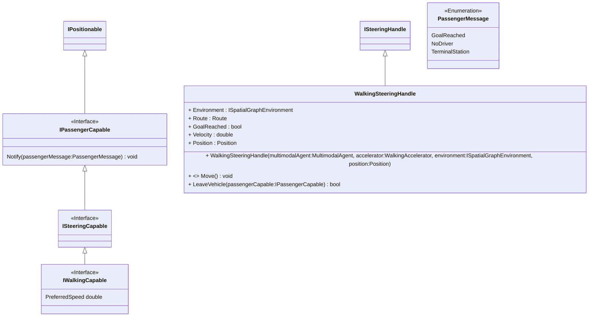

# Steering concept

To use a transportation capability (modal type) an agent requires to implement the ``ISteeringCapable`` interface (e.g. ``ICarSteeringCapable``, see figure below), which defines methods and properties that this agent must offer to be able to steer that ``Vehicle``.
Besides steering the vehicle the agent may also use some vehicles as a passenger (e.g. using the [``Ferry``](entities.md#ferry)). The ``IPassengerCapable`` is implemented by the [``MultimodalAgent``](agents/multi_modal_agent.md) and informs the agent with a ``PassengerMessage`` about the current status of the drive. It may for instance notify the agent at every stop (e.g. ``FerryStation``) so that the agent may decide to leave or stay on the ferry.

The ``ISteeringHandle`` is the interface for an agent to drive the vehicle. Every ``Vehicle`` has a specific steering handle and provides that to the agent on successful enter.

Adding new transportation modalities is supported by the ``MultimodalAgent`` if it complies with the *steering concept* (see below).

